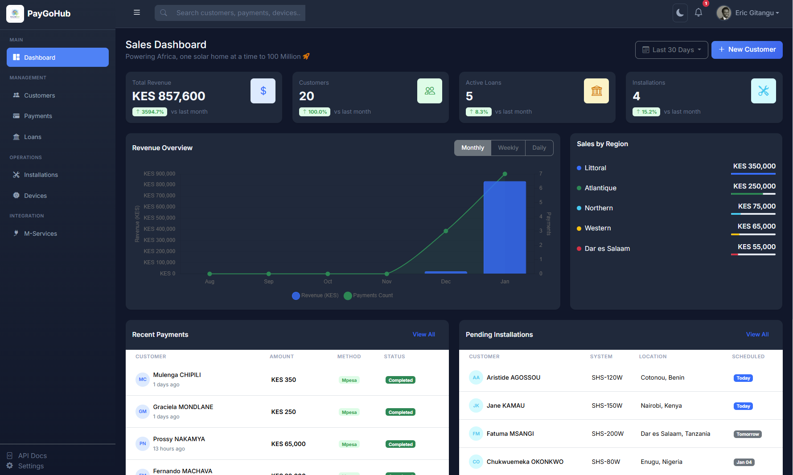

# PayGoHub

ASP.NET Core 10.0 MVC application for solar home systems management and pay-as-you-go payments.



## Features

- **Sales Dashboard** - Real-time KPIs for revenue, customers, loans, and installations
- **Customer Management** - Full CRUD for customer lifecycle and qualification
- **Payment Processing** - M-Pesa integration for mobile money payments
- **Loan Management** - Track active loans and payment schedules
- **Device Management** - Solar system installations and unlock codes
- **Reporting** - Sales by region and revenue analytics

## Tech Stack

- .NET 10.0
- ASP.NET Core MVC
- Entity Framework Core 9.0 (Npgsql)
- PostgreSQL 16 (Dockerized)
- Bootstrap 5
- Bootstrap Icons
- Clean Architecture

## Architecture

```
PayGoHub/
├── src/
│   ├── PayGoHub.Domain/           # Entities, Enums, Interfaces
│   ├── PayGoHub.Application/      # Services interfaces, DTOs
│   ├── PayGoHub.Infrastructure/   # EF Core, DbContext, Services
│   └── PayGoHub.Web/              # MVC Controllers, Views
├── tests/
├── docker-compose.yml             # PostgreSQL + App containers
├── Dockerfile                     # Multi-stage build
├── PayGoHub.sln
└── README.md
```

## Getting Started

### Prerequisites

- .NET 10.0 SDK
- Docker & Docker Compose

### Quick Start with Docker

```bash
# Clone the repository
git clone https://github.com/ericgitangu/PayGoHub.git
cd PayGoHub

# Start PostgreSQL and the application
docker-compose up -d

# Open http://localhost:5000
```

### Local Development

```bash
# Start PostgreSQL only
docker-compose up -d db

# Run the application
cd src/PayGoHub.Web
dotnet run

# Open https://localhost:7239 or http://localhost:5068
```

### Database Migrations

```bash
# Create a new migration
dotnet ef migrations add MigrationName \
  --project src/PayGoHub.Infrastructure \
  --startup-project src/PayGoHub.Web \
  --output-dir Data/Migrations

# Apply migrations
dotnet ef database update \
  --project src/PayGoHub.Infrastructure \
  --startup-project src/PayGoHub.Web
```

## Project Structure

| Project | Purpose |
|---------|---------|
| **PayGoHub.Domain** | Entities (Customer, Payment, Loan, Installation, Device), Enums, Repository interfaces |
| **PayGoHub.Application** | Service interfaces, DTOs, ViewModels |
| **PayGoHub.Infrastructure** | EF Core DbContext, Entity configurations, Service implementations, Seed data |
| **PayGoHub.Web** | MVC Controllers, Razor Views, Static assets |

## Dashboard Features

| Section | Description |
|---------|-------------|
| **KPI Cards** | Revenue, Customers, Active Loans, Installations |
| **Revenue Chart** | Monthly/Weekly/Daily revenue visualization |
| **Sales by Region** | Geographic breakdown with progress indicators |
| **Recent Payments** | Latest M-Pesa and bank transactions |
| **Pending Installations** | Scheduled system installations |
| **Quick Actions** | Add customer, View payments, Manage loans |
| **Activity Feed** | Real-time activity timeline |

## API Endpoints

| Controller | Routes |
|------------|--------|
| **Home** | `GET /` - Dashboard |
| **Customers** | `GET /Customers`, `GET /Customers/Create`, `POST /Customers/Create`, `GET /Customers/Edit/{id}`, `POST /Customers/Delete/{id}` |
| **Payments** | `GET /Payments`, `GET /Payments/Details/{id}` |
| **Loans** | `GET /Loans`, `GET /Loans/Details/{id}` |
| **Installations** | `GET /Installations`, `GET /Installations/Details/{id}` |
| **Devices** | `GET /Devices`, `GET /Devices/Details/{id}` |
| **Health** | `GET /health` |

## Docker Services

| Service | Port | Description |
|---------|------|-------------|
| **paygohub-web** | 5000 | ASP.NET Core MVC application |
| **paygohub-db** | 5433 | PostgreSQL 16 database |
| **paygohub-pgadmin** | 5050 | pgAdmin 4 (optional, use `--profile tools`) |

## Docker Commands

```bash
# Start full stack (recommended)
docker-compose up -d

# Start with pgAdmin for database management
docker-compose --profile tools up -d

# View logs
docker-compose logs -f web

# Rebuild after code changes
docker-compose up --build -d

# Stop all services
docker-compose down

# Stop and remove volumes (fresh start)
docker-compose down -v
```

## Environment Variables

| Variable | Default | Description |
|----------|---------|-------------|
| `DB_PASSWORD` | paygohub123 | PostgreSQL password |
| `ASPNETCORE_ENVIRONMENT` | Production | Runtime environment |
| `ConnectionStrings__DefaultConnection` | (auto) | Database connection string |

## Testing & CI/CD

### Running Tests

```bash
# Run all tests
dotnet test

# Run tests with coverage
dotnet test --collect:"XPlat Code Coverage"

# Run specific test category
dotnet test --filter "Category=Unit"
```

### CI Pipeline

The project includes a comprehensive GitHub Actions CI pipeline (`.github/workflows/ci.yml`) with:

| Stage | Description |
|-------|-------------|
| **Build & Test** | Restores, builds, and runs all unit tests with PostgreSQL service |
| **Code Quality** | Checks code formatting with `dotnet format` |
| **Security Scan** | Checks for vulnerable and outdated NuGet packages |
| **Docker Build** | Builds and validates the Docker image |
| **Integration Tests** | Runs tests against docker-compose services |
| **E2E Tests** | Playwright-based browser tests (triggered with `[e2e]` in commit message) |

### QA Tools

| Tool | Purpose |
|------|---------|
| **xUnit** | Unit testing framework |
| **NUnit** | E2E testing framework |
| **Playwright** | Browser automation for E2E tests |
| **FluentAssertions** | Readable test assertions |
| **Moq** | Mocking framework |
| **Coverlet** | Code coverage collection |
| **ReportGenerator** | Coverage report generation |

### E2E Testing with Playwright

```bash
# Install Playwright browsers (first time only)
pwsh tests/PayGoHub.E2E/bin/Debug/net10.0/playwright.ps1 install

# Start the application
docker-compose up -d

# Run E2E tests
dotnet test tests/PayGoHub.E2E --filter "Category=E2E"

# Run smoke tests only
dotnet test tests/PayGoHub.E2E --filter "Category=Smoke"

# Run with specific browser
BROWSER=firefox dotnet test tests/PayGoHub.E2E

# Target different environment
BASE_URL=https://staging.example.com dotnet test tests/PayGoHub.E2E
```

### Test Structure

```
tests/
├── PayGoHub.Tests/           # Unit & Integration tests
│   ├── Unit/                 # Unit tests with InMemory DB
│   └── Integration/          # Integration tests
└── PayGoHub.E2E/             # End-to-End tests
    ├── PageObjects/          # Page Object Models
    └── Tests/                # E2E test classes
```

## Seed Data

The application seeds realistic Kenyan PayGo data on first run:
- 10 Customers (Jane Kamau, Peter Otieno, etc.)
- 20 Payments (M-Pesa transactions)
- 8 Loans (various statuses)
- 6 Installations (scheduled for today/tomorrow)
- 10 Devices (SHS-80W to SHS-200W)

## Documentation

See [solarhub-to-paygohub-porting-guide.md](./solarhub-to-paygohub-porting-guide.md) for the comprehensive guide on porting from Rails to .NET.

## License

MIT
