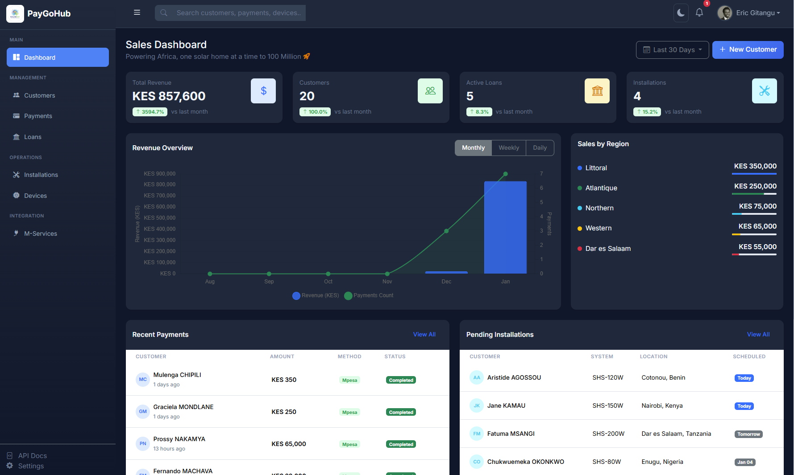

# PayGoHub

ASP.NET Core 10.0 MVC · Clean Architecture · PostgreSQL · GCP Cloud Run (africa-south1)

**Live:** [paygohub-904401126919.africa-south1.run.app](https://paygohub-904401126919.africa-south1.run.app)



## Features

- **Dashboard** — Real-time KPIs: revenue, customers, active loans, installations
- **Customer Management** — Full CRUD with region/district organisation
- **Payment Processing** — M-Pesa, MTN MoMo, Bank, Cash tracking
- **Loan Management** — Full lifecycle from application to payoff
- **Installations** — Technician scheduling and completion tracking
- **Device Monitoring** — Solar home system status and health
- **Activity Feed** — Audit log with entity-level event trail
- **Google OAuth** — One-click sign-in; email/password fallback

## Tech Stack

| Layer | Choice |
|---|---|
| Runtime | .NET 10.0 (preview) |
| Framework | ASP.NET Core MVC |
| ORM | EF Core 10.0 + Npgsql |
| DB | PostgreSQL 16 (Cloud SQL) |
| Auth | Google OAuth 2.0 + Cookie |
| Data Protection | EF Core key-ring persistence |
| Frontend | Razor + Bootstrap 5 + Chart.js |
| Deploy | GCP Cloud Run (africa-south1) |
| Image registry | Artifact Registry |
| Secrets | GCP Secret Manager |

## Architecture

```
PayGoHub/
├── src/
│   ├── PayGoHub.Domain/           # Entities, Enums
│   ├── PayGoHub.Application/      # Service interfaces, DTOs
│   ├── PayGoHub.Infrastructure/   # EF Core, DbContext, entity configs, services
│   └── PayGoHub.Web/              # MVC controllers, Razor views, middleware
├── tests/
│   ├── PayGoHub.Tests/            # xUnit unit + integration
│   └── PayGoHub.E2E/              # Playwright E2E
├── cloudbuild.yaml                # GCP Cloud Build
├── Dockerfile                     # Multi-stage (.NET 10 SDK → runtime)
└── docker-compose.yml             # Local: PostgreSQL + app
```

## Local Development

```bash
# PostgreSQL + app
docker compose up -d

# PostgreSQL only (run app via dotnet)
docker compose up -d db
cd src/PayGoHub.Web && dotnet run
# → http://localhost:5068

# Migrations
dotnet ef migrations add <Name> \
  --project src/PayGoHub.Infrastructure \
  --startup-project src/PayGoHub.Web

dotnet ef database update \
  --project src/PayGoHub.Infrastructure \
  --startup-project src/PayGoHub.Web
```

### Environment variables

| Variable | Required | Notes |
|---|---|---|
| `ConnectionStrings__DefaultConnection` | yes | Postgres connection string |
| `GOOGLE_CLIENT_ID` | no | OAuth disabled when absent |
| `GOOGLE_CLIENT_SECRET` | no | OAuth disabled when absent |
| `ASPNETCORE_ENVIRONMENT` | — | `Development` locally |

Google OAuth is registered conditionally — the app starts without credentials (useful in CI or local dev without OAuth setup).

## Production Deployment (GCP Cloud Run)

```bash
# Build + push via Cloud Build
gcloud builds submit \
  --tag africa-south1-docker.pkg.dev/pawacloud-assessment/pawacloud/paygohub:latest \
  --region=africa-south1 --project=pawacloud-assessment

# Deploy
gcloud run deploy paygohub \
  --image=africa-south1-docker.pkg.dev/pawacloud-assessment/pawacloud/paygohub:latest \
  --region=africa-south1 --project=pawacloud-assessment

# Tail logs
gcloud logging read \
  'resource.type="cloud_run_revision" resource.labels.service_name="paygohub"' \
  --project=pawacloud-assessment --limit=50 --format='value(timestamp,textPayload)'
```

Secrets are loaded from GCP Secret Manager at container start via `--update-secrets`. The Cloud SQL instance (`pawacloud-assessment:africa-south1:pawacloud-db`) is accessed via Unix socket using the `--add-cloudsql-instances` flag.

## CI/CD

GitHub Actions (`.github/workflows/ci.yml`):

| Stage | Notes |
|---|---|
| Build & Test | Unit tests with PostgreSQL service container |
| Code Quality | `dotnet format` check |
| Security Scan | NuGet vulnerability audit |
| Docker Build | Validates multi-stage Dockerfile |
| Integration Tests | docker compose services |
| E2E Tests | Playwright; triggered by `[e2e]` in commit message |

## Operational Notes

### Migration idempotency

EF Core's `MigrateAsync()` applies all pending migrations in a single transaction per migration. A failure in any migration's `Up()` rolls back that migration and halts the chain — subsequent migrations never run.

**Lesson:** Every corrective or out-of-band migration must be idempotent. Use `IF EXISTS` / `IF NOT EXISTS` guards in raw SQL migrations, never assume prior state.

Key patterns used:

```sql
-- Rename only when source column exists
DO $$
BEGIN
    IF EXISTS (
        SELECT 1 FROM information_schema.columns
        WHERE table_name = 'customers' AND column_name = 'AccountNumber'
    ) THEN
        ALTER TABLE customers RENAME COLUMN "AccountNumber" TO account_number;
    END IF;
END $$;

-- Create table only when absent
CREATE TABLE IF NOT EXISTS "DataProtectionKeys" (
    "Id" SERIAL PRIMARY KEY,
    "FriendlyName" TEXT,
    "Xml" TEXT
);
```

### Npgsql 10 + explicit column names

Npgsql.EntityFrameworkCore.PostgreSQL 10.0 does **not** auto-apply snake_case unless you call `UseSnakeCaseNamingConvention()`. Column mappings that differ from the C# property name must be declared explicitly in entity configurations (`HasColumnName(...)`). If a raw SQL migration creates a column with a different casing than the EF configuration, every query against that entity will fail with `column does not exist`.

Audit entity configurations in `PayGoHub.Infrastructure/Data/Configurations/` if you see this class of error.

### Data Protection key persistence

ASP.NET Core Data Protection generates an in-process key ring at startup. On Cloud Run, each new container revision — or any scale-out event — gets a fresh key ring. OAuth correlation cookies (written during `/Account/signin-google` challenge) are encrypted with the key ring; if the responding container's ring differs from the one that wrote the cookie, the callback fails with `Correlation failed`.

Fix: `IDataProtectionKeyContext` implemented on `PayGoHubDbContext`, keys persisted via `AddDataProtection().PersistKeysToDbContext<PayGoHubDbContext>()`. The `DataProtectionKeys` table is created by `AddDataProtectionKeys` migration.

### Conditional Google OAuth

`AddGoogle()` throws at startup if `ClientId` is an empty string. OAuth credentials are loaded from GCP Secret Manager at runtime; during CI builds or local dev without credentials set, the app falls back to cookie-only auth. Always gate behind:

```csharp
var hasGoogleOAuth = !string.IsNullOrEmpty(googleClientId) && !string.IsNullOrEmpty(googleClientSecret);
if (hasGoogleOAuth) { authBuilder.AddGoogle(...); }
```

## Testing

```bash
dotnet test                                          # all tests
dotnet test --collect:"XPlat Code Coverage"         # with coverage
dotnet test --filter "Category=Unit"                # unit only

# E2E (requires running app)
pwsh tests/PayGoHub.E2E/bin/Debug/net10.0/playwright.ps1 install
dotnet test tests/PayGoHub.E2E --filter "Category=E2E"
```

## Seed Data

On first run, seeds realistic Kenyan PayGo data:
- 10 Customers · 20 Payments · 8 Loans · 6 Installations · 10 Devices · API clients

## License

MIT
