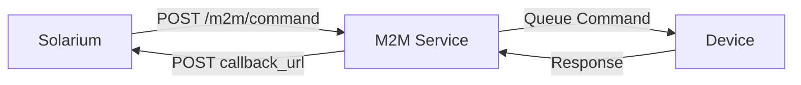
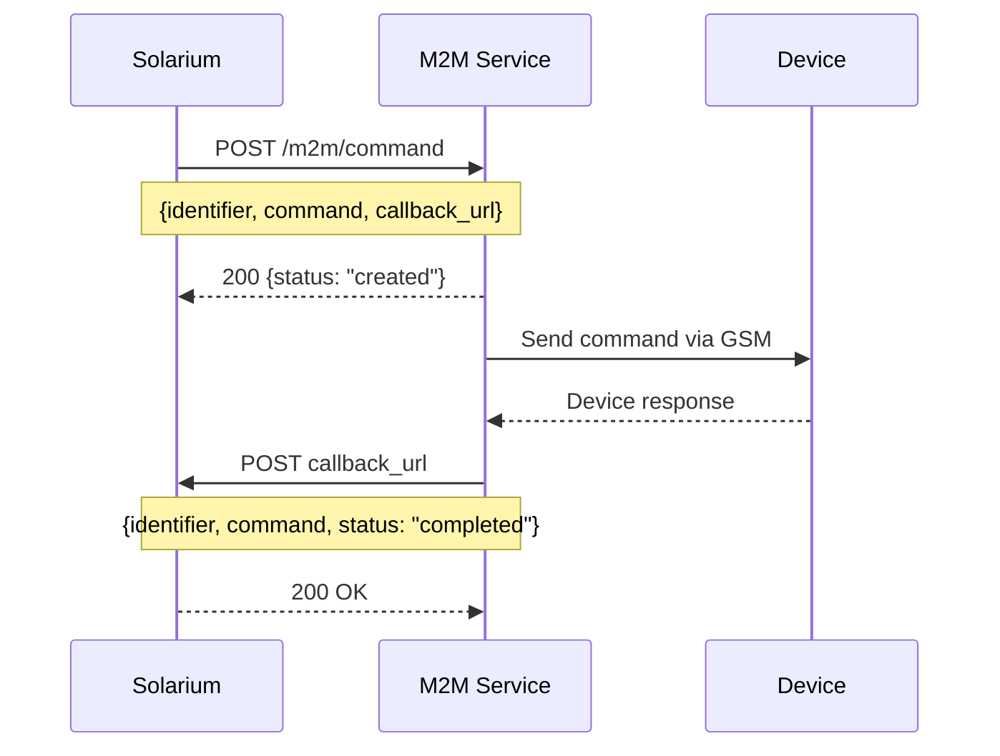
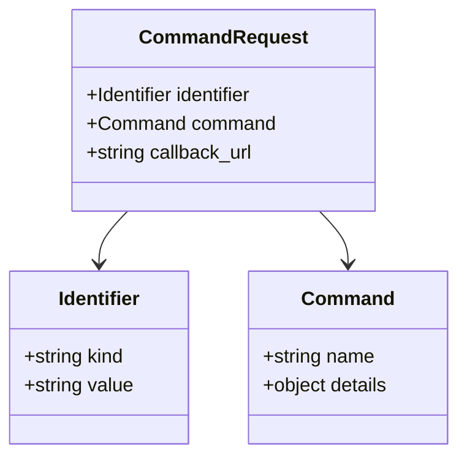
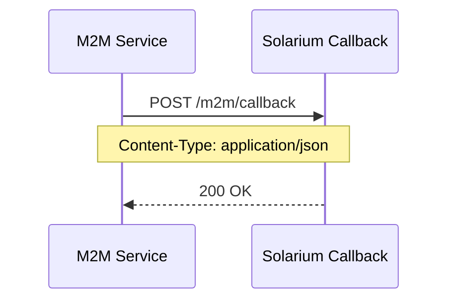
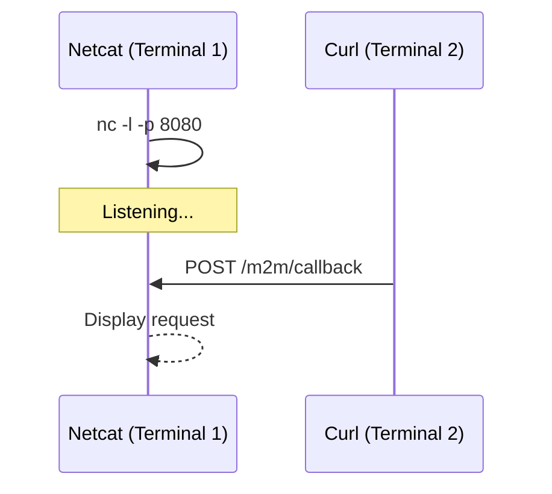

# M2M API Documentation

> Machine-to-Machine API for Solarium device communication with async callback support.

---

## Table of Contents
- [1. Overview](#1-overview)
- [2. Authentication](#2-authentication)
- [3. Command Flow](#3-command-flow)
- [4. API Reference](#4-api-reference)
- [5. Callback Handling](#5-callback-handling)
- [6. Local Testing](#6-local-testing)
- [7. Response Codes](#7-response-codes)
- [8. Environment Setup](#8-environment-setup)

---

## 1. Overview



The M2M service acts as a bridge between Solarium and IoT devices (Solar Controllers). Commands are queued and executed asynchronously, with results delivered via callback.

---

## 2. Authentication

| Header | Value | Source |
|--------|-------|--------|
| `X-API-Key` | `${M2M_API_KEY}` | `.env` file |
| `Content-Type` | `application/json` | - |

---

## 3. Command Flow

### 3.1 Sequence Diagram



### 3.2 Request → Response

**Request:**
```bash
curl -X POST "$M2M_API_URL" \
  -H "X-API-Key: $M2M_API_KEY" \
  -H "Content-Type: application/json" \
  -d '{
    "identifier": {
      "kind": "serial",
      "value": "SCBLNX/1/1234"
    },
    "command": {
      "name": "unlock_token",
      "details": {
        "unlock_code": "1234456"
      }
    },
    "callback_url": "https://solrm.com/api/Serial/m2m/callback"
  }'
```

**Response (HTTP 200):**
```json
{
  "identifier": "SCBLNX/1/1234",
  "command": "TOKEN:1234456",
  "status": "created",
  "created_at": "2025-12-19T06:38:38.000Z"
}
```

---

## 4. API Reference

### 4.1 Endpoints

| Method | Endpoint | Description |
|--------|----------|-------------|
| `GET` | `/m2m/ping` | Health check |
| `POST` | `/m2m/command` | Create device command |

**Base URL:** `https://nigeria-training.plugintheworld.com`

### 4.2 Request Schema



| Field | Type | Required | Description |
|-------|------|----------|-------------|
| `identifier.kind` | string | Yes | `serial` or `imei` |
| `identifier.value` | string | Yes | Device identifier |
| `command.name` | string | Yes | Command type |
| `command.details` | object | No | Command parameters |
| `callback_url` | string | Yes | Async response URL |

### 4.3 Available Commands

| Command | Description | Details |
|---------|-------------|---------|
| `unlock_token` | Send unlock token | `{ unlock_code: string }` |
| `sync` | Synchronize device | - |
| `synciv` | Sync with IV | - |
| `reset` | Reset device | - |
| `useracct` | User account ops | - |

### 4.4 Validation Error

Empty payload returns required fields:
```json
{
  "error": "Missing parameters: identifier, callback_url, command, name, kind"
}
```

---

## 5. Callback Handling

### 5.1 Callback Flow



### 5.2 Callback Payload

**What your endpoint receives:**
```json
{
  "identifier": "SCBLNX/1/1234",
  "command": "TOKEN:1234456",
  "status": "completed"
}
```

### 5.3 Callback Handler Requirements

| Requirement | Value |
|-------------|-------|
| Method | `POST` |
| Response | `200 OK` |
| Idempotency | Handle duplicate deliveries |

---

## 6. Local Testing

### 6.1 Mock Callback with Netcat



**Terminal 1 — Start listener:**
```bash
nc -l -p 8080
```

**Terminal 2 — Send mock callback:**
```bash
curl -X POST "http://localhost:8080/m2m/callback" \
  -H "Content-Type: application/json" \
  -d '{"identifier":"SCBLNX/1/1234","command":"TOKEN:1234456","status":"completed"}'
```

### 6.2 Captured HTTP Request

```http
POST /m2m/callback HTTP/1.1
Host: localhost:8080
User-Agent: curl/8.5.0
Accept: */*
Content-Type: application/json
Content-Length: 77

{"identifier":"SCBLNX/1/1234","command":"TOKEN:1234456","status":"completed"}
```

---

## 7. Response Codes

| Code | Status | Description |
|------|--------|-------------|
| `200` | OK | Success |
| `201` | Created | Command created |
| `400` | Bad Request | Missing/invalid parameters |
| `401` | Unauthorized | Invalid API key |
| `404` | Not Found | Resource not found |
| `422` | Unprocessable | Validation failed |
| `500` | Server Error | Internal error |

---

## 8. Environment Setup

### 8.1 Configuration

**`.env`** (git-ignored):
```bash
M2M_API_URL=https://nigeria-training.plugintheworld.com/m2m/command
M2M_API_URL_V1=https://nigeria-training.plugintheworld.com/v1/commands
M2M_API_KEY=<your-api-key>
M2M_CALLBACK_URL=https://solrm.com/api/Serial/m2m/callback
```

### 8.2 Scripts

**Shell script:**
```bash
./scripts/m2m-command.sh [serial_number] [unlock_code]

# Example
./scripts/m2m-command.sh SCBLNX/1/1234 1234456
```

**TypeScript (requires axios, dotenv):**
```bash
npx ts-node scripts/m2m-command.ts [serial_number] [unlock_code]
```

### 8.3 Security Notes

- Never commit `.env` to version control
- API key authenticates all M2M requests
- Callback URL must be publicly accessible
- Devices use separate basic auth with PowerHub

---

## References

- [M2M Microservice RFC](source-documents/M2M%20Microservice%20RFC.docx) — Full OpenAPI 3.0.3 specification
- [Solarium USSD MoMo Integration Spec](source-documents/Solarium_USSD_MoMo_Integration_Spec.docx) — Payment integration flows
