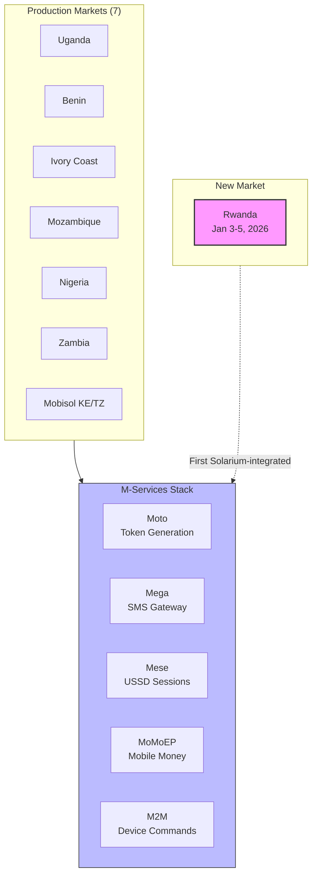
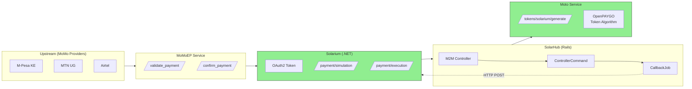
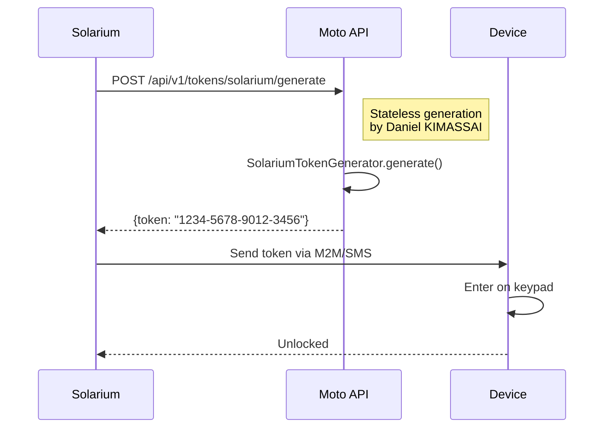
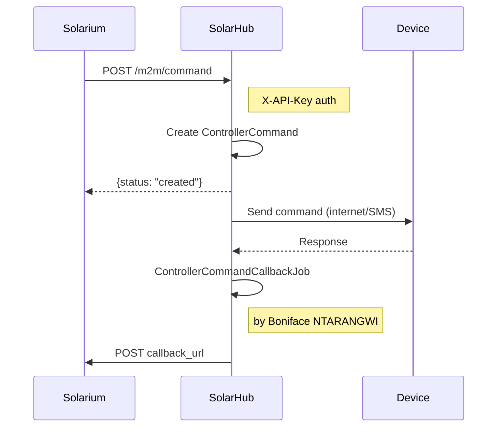
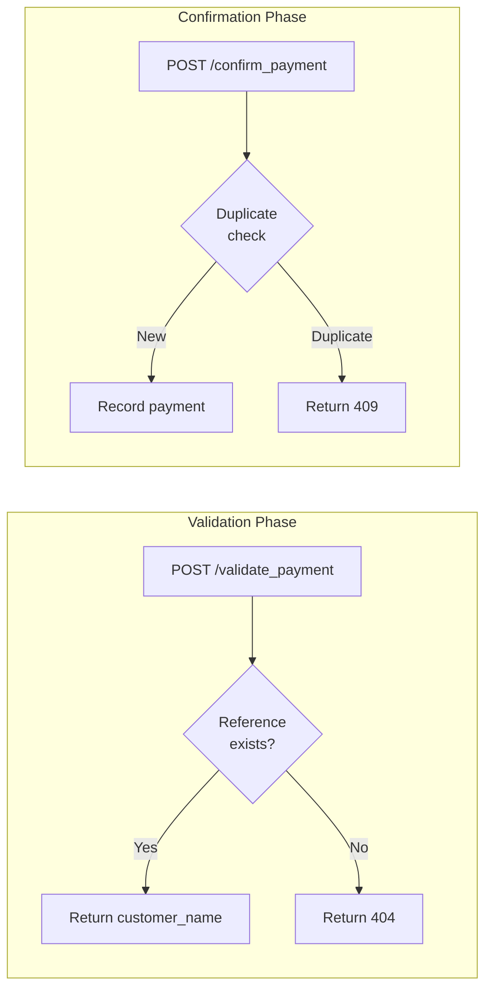
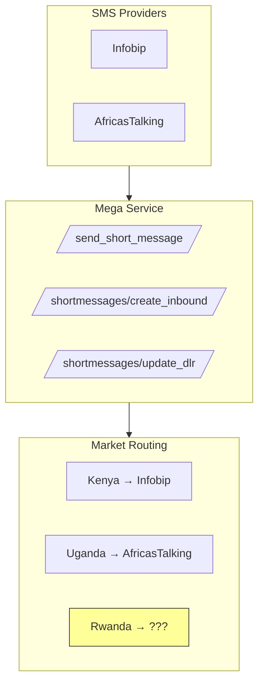
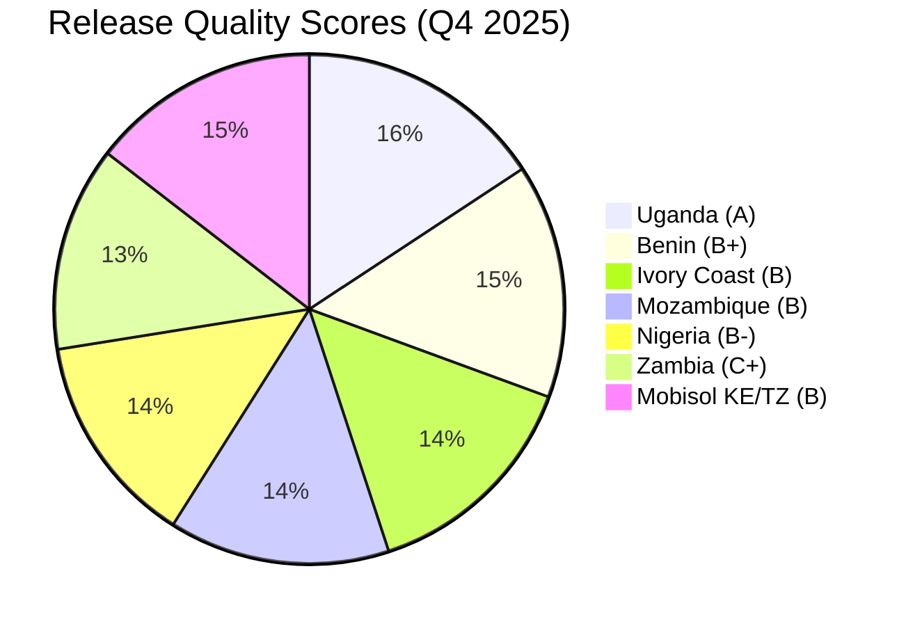
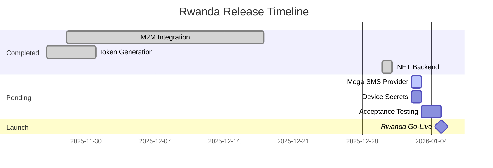

# M-Services Integration Status Report

**Prepared by:** Eric Gitangu (QA Lead)
**For:** Bineyame AFEWORK (Head of Software Engineering)
**Date:** December 31, 2025

---

## Market Overview



---

## Integration Architecture



---

## Implementation Status by Component

### Contributors (from Git History)

| Author | Role | Key Contributions |
|--------|------|-------------------|
| **Joshua OCERO** | M-Services Lead | Moto/Mega configs, device credentials |
| **Boniface NTARANGWI** | Backend Dev | M2M callbacks, command flow |
| **Daniel KIMASSAI** | Backend Dev | Stateless token generation, Solarium integration |
| **Albert LUMU** | Backend Dev | API-key auth, pairing, Sidekiq jobs |
| **Aureliu BRINZEANU** | Backend Dev | Mobisol M2M, error handling |
| **Pawan BORA** | Backend Dev | Device configurations |

---

## Component Status

### 1. Moto (Token Generation) ✅ PRODUCTION



**Status:** ✅ Complete
**Key Files:**
- `moto/lib/moto/solarium_token_generator.rb` - Stateless generation
- `moto/app/models/token.rb` - OpenPAYGO standard

**Commit:** `25cb680a8e27a49f6678a3c188c0f9ffd1f4d7e5` (Daniel KIMASSAI, Nov 26, 2025)

---

### 2. M2M (Device Commands) ✅ PRODUCTION



**Status:** ✅ Complete
**Key Files:**
- `solarhub/app/models/controller_command.rb`
- `solarhub/app/workers/controller_command_callback_job.rb`
- `solarhub/app/controllers/m2m_controller.rb`

**Commits:**
- `b7a0b76b` - Add callback_url field (Boniface, Nov 28, 2025)
- `32997caf` - Implement callback logic (Boniface, Nov 28, 2025)
- `027912946` - Mobisol nonblocking (Aureliu, 2025)

---

### 3. MoMoEP (Mobile Money) ✅ PRODUCTION



**Status:** ✅ Complete
**Location:** `momoep/` - Ruby service with downstream validation

---

### 4. Mega (SMS Gateway) ⚠️ PENDING INTEGRATION TEST



**Status:** ⚠️ Pending
**Blocker:** Rwanda SMS provider configuration needed
**Action:** Coordinate with Joshua OCERO for provider setup

---

### 5. Mese (USSD Sessions) ✅ PRODUCTION

**Status:** ✅ Complete for existing markets
**Location:** `mese/` - USSD session state machine

---

## PH <> Solarium Checklist

| Task | Status | Owner | Notes |
|------|--------|-------|-------|
| Device M2M migration | ✅ Done | Aureliu B | `Mobisol::RunCommandNonblocking` |
| Stateless token Moto to prod | ✅ Done | Daniel K | `SolariumTokenGenerator` |
| M2M API to prod | ✅ Done | Boniface N | Callback system complete |
| **Mega Integration** | ⚠️ **Pending** | Joshua O | Rwanda SMS provider TBD |
| Acquire SOLRM API keys | ✅ Done | - | OAuth2 credentials obtained |
| Share serials/secrets | ⏳ Pending | - | Awaiting Rwanda device shipment |
| Post-prod acceptance test | ⏳ Pending | Eric G | After Mega integration |

---

## .NET Backend Implementation (NEW)

```mermaid
classDiagram
    class PaymentApiController {
        +POST /api/payment/validate
        +POST /api/payment/confirm
    }

    class M2MApiController {
        +POST /api/m2m/command
        +GET /api/m2m/command/{id}
        +POST /api/m2m/callback
    }

    class TokensApiController {
        +POST /api/tokens/stateless/generate
        +POST /api/tokens/generate
    }

    class IMomoPaymentService {
        <<interface>>
        +ValidateAsync()
        +ConfirmAsync()
    }

    class IM2MCommandService {
        <<interface>>
        +CreateCommandAsync()
        +GetCommandStatusAsync()
        +ProcessCallbackAsync()
    }

    class ITokenGenerationService {
        <<interface>>
        +GenerateStatelessAsync()
        +GenerateAsync()
    }

    PaymentApiController --> IMomoPaymentService
    M2MApiController --> IM2MCommandService
    TokensApiController --> ITokenGenerationService
```

**Test Status:**
```
Unit Tests: 16/16 Passed ✅
Build: Successful ✅
```

---

## Quality Metrics by Market



**Scoring Formula:**
```
Score = 100 - (Fatal × 15) - (Error × 3) - (Warn × 0.5) - (BugEscapes × 5) + Bonus
```

---

## Rwanda Launch Readiness



---

## Action Items for 1:1

1. **Flex-hours Request:** Friday WFH during January rush
2. **Mega Integration:** Coordinate with Joshua for Rwanda SMS provider
3. **Device Secrets:** Pending shipment of Rwanda devices
4. **Acceptance Testing:** Schedule for Jan 3-5 with Fred

---

## Demo Commands

```bash
# Release Quality Dashboard
xdg-open /home/egitangu/Development/solarhub/script/eric/release_quality/reports/index.html

# Run .NET Unit Tests
cd /home/egitangu/Development/development_goals/dotnet
dotnet test tests/PayGoHub.Tests --filter "Category=Unit"

# M2M Command Test (from Solarium docs)
curl -X POST https://solarium.example/m2m/command \
  -H "X-API-Key: $M2M_API_KEY" \
  -d '{"identifier":{"kind":"serial","value":"DEVICE123"},"command":{"name":"unlock_token"}}'
```

---

## References

| Document | Location |
|----------|----------|
| Solarium Integration | `/home/egitangu/Development/solarium/README.md` |
| M2M API Spec | `/home/egitangu/Development/solarium/m2m_api.md` |
| Release Quality | `/home/egitangu/Development/solarhub/script/eric/release_quality/` |
| E2E Tests | `/home/egitangu/Development/solarhub/script/eric/e2e_perf/` |
| .NET Implementation | `/home/egitangu/Development/development_goals/dotnet/` |
