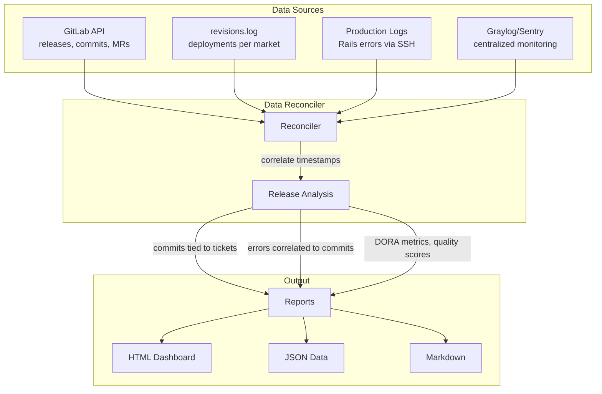

# Release Quality Tracking

Ruby-based system for benchmarking QA maturity by collecting production errors across markets, comparing releases, and tracking quality improvements.

## Features

- **Real production error collection**:
  - **SSH/LXC logs**: Direct access to Rails `production.log` via `lxc exec` on hosts
  - **kubectl logs**: K8s pod logs for ivorycoast, mobisol
  - **nginx LB logs**: HTTP 4xx/5xx errors from host load balancers (fallback)
  - **Graylog API**: Centralized log aggregation
  - **Sentry API**: Exception tracking with stack traces
- **GitLab API integration**: Release metadata, commits, DORA metrics
- **7 production markets**: Uganda, Benin, Ivory Coast, Mozambique, Nigeria, Zambia, Mobisol
- **Release comparison**: Detect regressions, resolved errors, quality trends
- **Quality scoring**: 0-100 composite score based on bug escapes, severity, regressions
- **Multiple report formats**: Markdown, JSON, HTML (dark mode)

---

## Quick Start

```bash
cd script/eric/release_quality
bundle install
cp .env.example .env  # Edit with API credentials

# Generate comparison reports
ruby compare_releases.rb 1.2.5 1.2.6
xdg-open reports/index.html
```

### Verify Connectivity

```bash
# Test SSH access to production containers
ssh funo.payg.ee 'lxc exec uganda-fu -- echo OK'
ssh kare.payg.ee 'lxc exec benin-ka -- echo OK'

# Check configuration status
ruby -e 'require_relative "lib/release_quality"; c = ReleaseQuality.configuration
puts "GitLab: #{c.gitlab_configured?}", "Graylog: #{c.graylog_configured?}", "Sentry: #{c.sentry_configured?}"'

# List available releases
ruby -e 'require_relative "lib/release_quality"; ReleaseQuality::Collectors::GitLabCollector.new.list_releases.each { |r| puts "#{r[:tag]} - #{r[:created_at]}" }'
```

---

## Architecture



### How Errors Are Tied to Releases

1. **Get Release SHA** from GitLab API (e.g., `v1.2.6` → `abc123`)
2. **Find Deployment Time** from `revisions.log` via SSH per market
3. **Calculate Window** from deployment of this release to next release
4. **Filter Logs** to only include errors within that time window
5. **Correlate** errors to commits based on keywords/file paths

---

## CLI Commands

### collect_errors

```bash
./bin/collect_errors [options]

Options:
  -r, --release TAG      Release tag (required)
  -m, --market MARKET    Specific market (default: all)
  -h, --hours HOURS      Lookback hours (default: 48)
  -o, --output FILE      Output file
  --save                 Save to data directory

# Examples
./bin/collect_errors --release 1.2.5 --save
./bin/collect_errors --release 1.2.5 --market uganda --hours 24
```

### generate_report

```bash
./bin/generate_report [options]

Options:
  -r, --release TAG      Release tag (required)
  -f, --format FORMAT    markdown, json, html (default: markdown)
  -o, --output FILE      Output file (default: stdout)
  --collect              Collect errors before generating

# Examples
./bin/generate_report --release 1.2.5 --format html -o reports/1.2.5.html
./bin/generate_report --release 1.2.5 --collect --format markdown
```

### compare_releases

```bash
./bin/compare_releases BASE_TAG TARGET_TAG [options]

Options:
  -f, --format FORMAT    markdown, json, html (default: markdown)
  -o, --output FILE      Output file (default: stdout)
  --collect              Collect errors for both releases

# Examples
./bin/compare_releases 1.2.4 1.2.5
./bin/compare_releases 1.2.4 1.2.5 --format html -o comparison.html
```

### test_connectivity

```bash
./bin/test_connectivity [options]

Options:
  -m, --market MARKET    Test specific market (default: all)
  --host HOST            Test specific host (fu, ka, ng)
  --nginx                Also test nginx log access
  --deployments          Also test deployment history
  --verbose              Show detailed output

# Examples
./bin/test_connectivity --verbose
./bin/test_connectivity --market uganda --deployments
```

---

## Standalone Script: compare_releases.rb

Production-ready comparison with full commit analysis, DORA metrics, and per-market reports.

```bash
ruby compare_releases.rb 1.2.5 1.2.6
```

**Sample Output:**
```
======================================================================
Release Comparison: 1.2.5 vs 1.2.6
======================================================================

Data Sources:
  GitLab API: ENABLED
  Graylog:    disabled
  gee.rb:     ENABLED

Collecting data...
  Fetching from GitLab API...
    1.2.5: 32 commits (API)
    1.2.6: 48 commits between releases

  Collecting production errors...
    [1.2.5] SSH/LXC [uganda]: 12 errors
    [1.2.5] SSH/LXC [benin]: 5 errors
    [1.2.6] SSH/LXC [uganda]: 7 errors

    Collection Summary:
      SSH/LXC logs:   32 errors
      Nginx LB logs:  10 errors
      TOTAL:          42 errors

Reports generated: reports/index.html
```

**Generated Structure:**
```
reports/
├── index.html              # Navigation dashboard
├── overview/               # All markets combined
│   ├── comparison_1.2.5_vs_1.2.6.html
│   └── release_*.html
├── uganda/                 # Per-market reports
├── benin/
├── ivorycoast/
├── mozambique/
├── nigeria/
├── zambia/
└── mobisol/
```

---

## Markets

| Market | Code | Type | Host | Access Command |
|--------|------|------|------|----------------|
| Uganda | UG | LXC | funo (fu) | `ssh funo.payg.ee 'lxc exec uganda-fu -- ...'` |
| Benin | BJ | LXC | kare (ka) | `ssh kare.payg.ee 'lxc exec benin-ka -- ...'` |
| Mozambique | MZ | LXC | kare (ka) | `ssh kare.payg.ee 'lxc exec mozambique-ka -- ...'` |
| Nigeria | NG | LXC | nguruwe (ng) | `ssh nguruwe.payg.ee 'lxc exec nigeria-ng -- ...'` |
| Zambia | ZM | LXC | nguruwe (ng) | `ssh nguruwe.payg.ee 'lxc exec zambia-ng -- ...'` |
| Ivory Coast | CI | K8s | powerhub-prod | `kubectl logs deploy/powerhub-ivorycoast` |
| Mobisol | KE | K8s | powerhub-staging | `kubectl logs deploy/powerhub-mobisol` |

### Host Abbreviations

| Abbrev | Hostname | Markets |
|--------|----------|---------|
| fu | funo.payg.ee | Uganda |
| ka | kare.payg.ee | Benin, Mozambique |
| ng | nguruwe.payg.ee | Nigeria, Zambia |
| pa | papa.payg.ee | SaaS instances |

### Dynamic Discovery

```bash
./bin/discover --refresh      # Discover all containers
./bin/discover --host ka      # Discover specific host
```

---

## Configuration

### Environment Variables

| Variable | Description | Default |
|----------|-------------|---------|
| `GITLAB_TOKEN` | GitLab API token | - |
| `GITLAB_PROJECT_ID` | Project ID | - |
| `GRAYLOG_HOST` | Graylog server | graylog.payg.ee |
| `GRAYLOG_TOKEN` | Graylog API token | - |
| `SENTRY_AUTH_TOKEN` | Sentry token | - |
| `SENTRY_ORG` | Sentry organization | - |
| `GEE_RB_PATH` | Path to gee.rb | ~/Development/gee-rb/gee.rb |
| `LOOKBACK_HOURS` | Error lookback window | 48 |
| `MAX_ERRORS_PER_MARKET` | Max errors per market | 1000 |

### API Tokens

| Token | Provides | Without It |
|-------|----------|------------|
| `GITLAB_TOKEN` | Release dates, commits, MRs, DORA metrics | Sample data |
| `GRAYLOG_TOKEN` | Production errors with severity, market | SSH fallback |
| `SENTRY_AUTH_TOKEN` | Stack traces, user impact, release correlation | SSH fallback |

### Config Files

- `config/markets.yml` - Market definitions and instance types
- `config/severity_mapping.yml` - Error severity rules
- `config/excluded_errors.yml` - Patterns to exclude

---

## Quality Metrics

### Quality Score (0-100)

```
Score = 100 - (Fatal × 15) - (Error × 3) - (Warn × 0.5) - (BugEscapes × 5) + Bonus
```

**Example:**
```
Base: 100
Fatal (2 × 15): -30
Error (8 × 3): -24
Warn (4 × 0.5): -2
Bug Escapes (3 × 5): -15
Low Error Bonus: +5
= 34
```

| Score | Grade |
|-------|-------|
| 90-100 | A |
| 80-89 | B |
| 70-79 | C |
| 60-69 | D |
| < 60 | F |

### Bug Escape Rate

Errors that could have been caught by tests:
- `NoMethodError`, `ArgumentError`, `TypeError`
- `ActiveRecord::RecordInvalid`
- `ActionController::ParameterMissing`

---

## Error Sources

### 1. SSH/LXC Production Logs
Rails `production.log` via `lxc exec`:
```bash
ssh funo.payg.ee 'lxc exec uganda-fu -- tail -1000 /app/log/production.log'
```

### 2. kubectl Logs (K8s Markets)
```bash
kubectl logs deploy/powerhub-ivorycoast --tail=1000
```

### 3. nginx LB Logs (Fallback)
When container SSH unavailable:
```bash
ssh funo.payg.ee 'sudo tail -5000 /var/log/nginx/access.log'
```

### 4. revisions.log
Deployment history per market:
```
Branch release (at abc1234) deployed as release 20251218152300 by deployer
```

### 5. Graylog/Sentry APIs
Centralized monitoring with severity levels and stack traces.

---

## HTML Reports

Dark-mode HTML reports include:

| Section | Content |
|---------|---------|
| Data Sources Panel | Active collectors (SSH, nginx, Graylog, Sentry) |
| Infrastructure | LXC containers and K8s deployments |
| Quality Score Card | Score with calculation breakdown |
| DORA Metrics | Deploy frequency, lead time, MTTR |
| Commit Analysis | By category (feature, bugfix, hotfix) |
| Market Health | Per-market scores with formulas |
| Error Tables | Top errors by severity with source badges |
| Comparison View | Side-by-side metrics with trends |

**Error Source Badges:**
| Badge | Source |
|-------|--------|
| SSH | LXC container logs |
| nginx | Host load balancer |
| Graylog | Centralized logging |
| Sentry | Exception tracking |
| k8s | Kubernetes pods |

---

## Directory Structure

```
release_quality/
├── bin/                    # CLI executables
│   ├── collect_errors
│   ├── generate_report
│   ├── compare_releases
│   └── test_connectivity
├── lib/release_quality/
│   ├── collectors/         # SSH, Graylog, Sentry, GitLab
│   ├── reporters/          # HTML, JSON, Markdown
│   ├── analyzers/          # Analysis modules
│   └── models/             # ErrorRecord, Release
├── config/                 # markets.yml, severity_mapping.yml
├── data/                   # Collected data (gitignored)
└── reports/                # Generated reports
```

---

## Troubleshooting

### LXC Permission Denied (Nigeria, Zambia)

```
Error: dial unix /var/snap/lxd/common/lxd/unix.socket: permission denied
```

**Fix (DevOps):**
```bash
# On nguruwe.payg.ee:
sudo usermod -aG lxd solarhub
```

### K8s Deployment Not Found

```
error: deployments.apps "powerhub-ivorycoast" not found
```

**Fix:**
```bash
kubectl --context=oidc-powerhub-prod@k8s-powerhub-prod \
  -n powerhub-ivorycoast get deployments
```

### SSH Connection Failed

1. Request access from DevOps for `solarhub@*.payg.ee`
2. Add SSH public key to servers
3. Test: `ssh solarhub@uganda-fu.funo.payg.ee`

### kubectl Access Failed

1. Install and configure `kubectl`
2. Check context: `kubectl config get-contexts`
3. Request OIDC access from DevOps

### No Data Sources Configured

Configure at least one:
- Set `GRAYLOG_HOST` + `GRAYLOG_TOKEN`
- Set `SENTRY_AUTH_TOKEN` + `SENTRY_ORG`
- Set `GEE_RB_PATH` to valid gee.rb

### Test Connectivity

```bash
./bin/test_connectivity --verbose --market uganda
```

---

## DevOps Permissions Summary

| Host | Permission | Markets | Command |
|------|------------|---------|---------|
| nguruwe.payg.ee | LXC group | Nigeria, Zambia | `usermod -aG lxd solarhub` |
| nguruwe.payg.ee | sudo nginx | Nigeria, Zambia | Add to sudoers |
| K8s cluster | OIDC auth | Ivory Coast, Mobisol | Check cluster access |

When data collection fails, placeholder reports show the exact DevOps commands needed.

---

## Development

### Running Tests
```bash
bundle exec rspec
```

### Adding a Collector

1. Create file in `lib/release_quality/collectors/`
2. Extend `BaseCollector`
3. Implement `#collect` and `#source_name`
4. Add require in `lib/release_quality.rb`

### Adding a Reporter

1. Create file in `lib/release_quality/reporters/`
2. Extend `BaseReporter`
3. Implement `#generate_release_report` and `#generate_comparison_report`
