# Solarium Integration Documentation

[](README.md)
[](#status)
[](#api-reconnaissance-findings)
[](#overview)
[](#supported-markets)
[](#server-infrastructure-details)
[](#moto-token-api-payg-token-generation)
[](#license)

## Table of Contents

- [Overview](#overview)
- [System Architecture](#system-architecture)
- [Integration Flows](#integration-flows)
  - [USSD Payment Flow](#ussd-payment-flow)
  - [Validation Flow](#validation-flow)
  - [Confirmation Flow](#confirmation-flow)
  - [M2M Device Flow](#m2m-device-flow)
- [API Specifications](#api-specifications)
  - [Solarium Inbound APIs](#solarium-inbound-apis-from-momo)
  - [Solarium Outbound APIs](#solarium-outbound-apis-external)
  - [M2M APIs](#m2m-apis)
  - [Moto Token API](#moto-token-api-payg-token-generation)
- [API Reconnaissance Findings](#api-reconnaissance-findings)
- [Possible Integrations](#possible-integrations)
- [Assumptions](#assumptions)
- [Baseline Understanding](#baseline-understanding)
- [Status](#status)

---

## Overview

This documentation describes the integration between **Solarium** (payment/billing platform), **MoMo** (Mobile Money gateway), **MESE** (USSD session host), and **M2M** (Machine-to-Machine device communication service).

### Key Systems

| System | Role | Technology |
|--------|------|------------|
| **Solarium** | Core billing/payment platform | API-driven |
| **MESE** | USSD session hosting | Template-based pages |
| **MoMo** | Mobile Money middleware | Multi-provider gateway |
| **M2M** | Device communication | Rails microservice |

### Supported Markets

| Country | Currency | Providers |
|---------|----------|-----------|
| Uganda (UG) | UGX | MTN Mobile Money |
| Kenya (KE) | KES | Safaricom M-PESA, Equity EazzyPay |
| Tanzania (TZ) | TZS | Halotel Halopesa |

---

## System Architecture

### High-Level Architecture

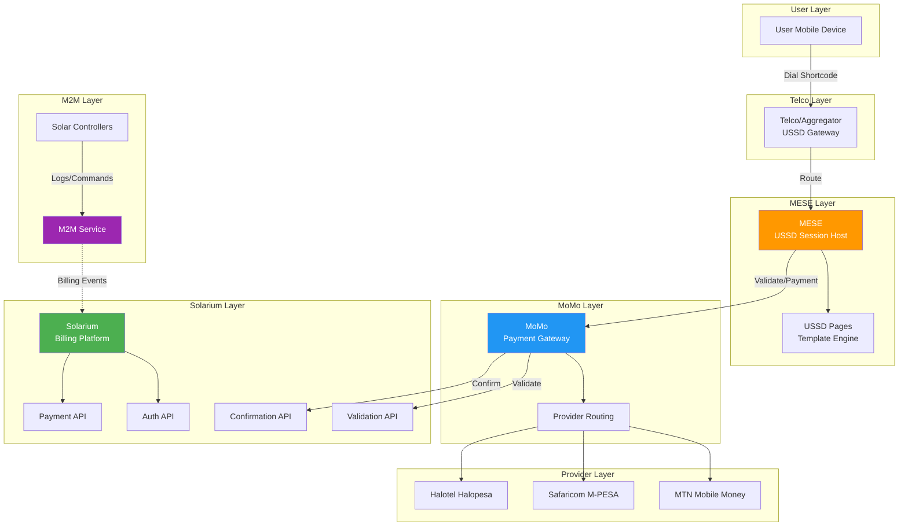
```mermaid
graph TB
    subgraph "User Layer"
        U[User Mobile Device]
    end

    subgraph "Telco Layer"
        T[Telco/Aggregator<br/>USSD Gateway]
    end

    subgraph "MESE Layer"
        M[MESE<br/>USSD Session Host]
        MP[USSD Pages<br/>Template Engine]
    end

    subgraph "MoMo Layer"
        MO[MoMo<br/>Payment Gateway]
        PR[Provider Routing]
    end

    subgraph "Provider Layer"
        MTN[MTN Mobile Money]
        MPESA[Safaricom M-PESA]
        HALO[Halotel Halopesa]
    end

    subgraph "Solarium Layer"
        S[Solarium<br/>Billing Platform]
        SV[Validation API]
        SC[Confirmation API]
        SA[Auth API]
        SP[Payment API]
    end

    subgraph "M2M Layer"
        M2M[M2M Service]
        DEV[Solar Controllers]
    end

    U -->|Dial Shortcode| T
    T -->|Route| M
    M --> MP
    M -->|Validate/Payment| MO
    MO --> PR
    PR --> MTN
    PR --> MPESA
    PR --> HALO
    MO -->|Validate| SV
    MO -->|Confirm| SC
    S --> SA
    S --> SP
    DEV -->|Logs/Commands| M2M
    M2M -.->|Billing Events| S

    style S fill:#4CAF50,color:#fff
    style MO fill:#2196F3,color:#fff
    style M fill:#FF9800,color:#fff
    style M2M fill:#9C27B0,color:#fff
```

### Component Interaction Matrix

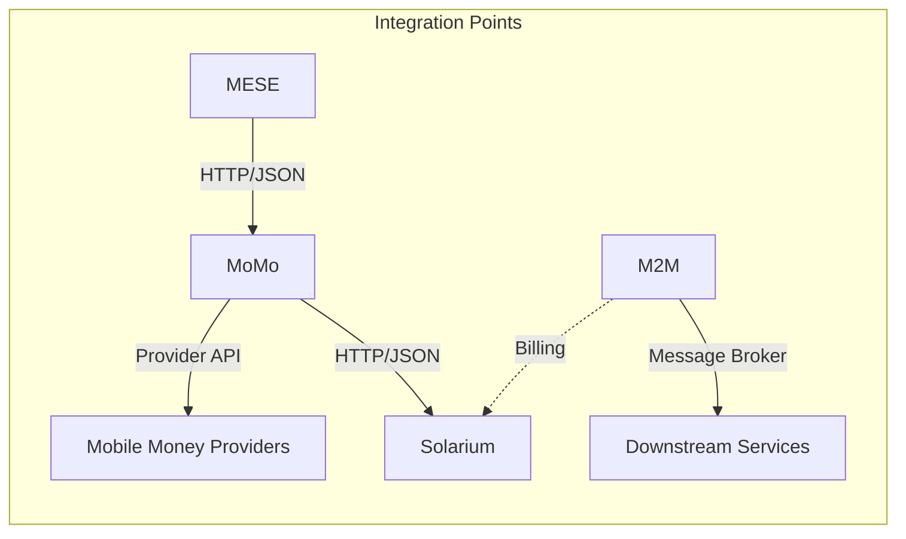
```mermaid
graph LR
    subgraph "Integration Points"
        A[MESE] -->|HTTP/JSON| B[MoMo]
        B -->|HTTP/JSON| C[Solarium]
        B -->|Provider API| D[Mobile Money Providers]
        E[M2M] -->|Message Broker| F[Downstream Services]
        E -.->|Billing| C
    end
```

---

## Integration Flows

### USSD Payment Flow

Complete end-to-end flow from user dial to payment confirmation:

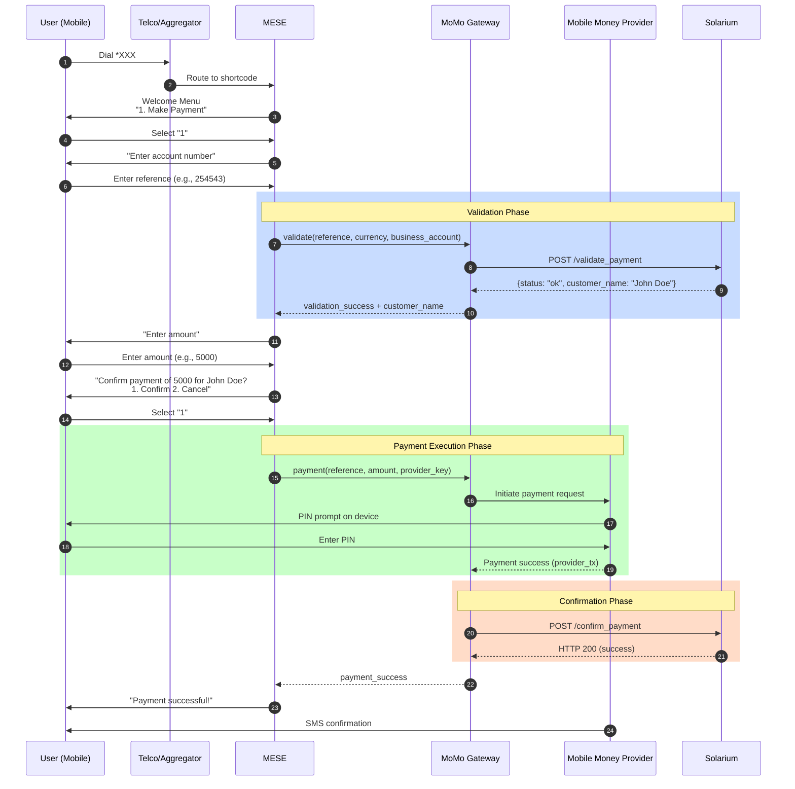
```mermaid
sequenceDiagram
    autonumber
    participant User as User (Mobile)
    participant Telco as Telco/Aggregator
    participant MESE as MESE
    participant MoMo as MoMo Gateway
    participant Provider as Mobile Money Provider
    participant Solarium as Solarium

    User->>Telco: Dial *XXX#
    Telco->>MESE: Route to shortcode
    MESE->>User: Welcome Menu<br/>"1. Make Payment"
    User->>MESE: Select "1"
    MESE->>User: "Enter account number"
    User->>MESE: Enter reference (e.g., 254543)

    rect rgb(200, 220, 255)
        Note over MESE,Solarium: Validation Phase
        MESE->>MoMo: validate(reference, currency, business_account)
        MoMo->>Solarium: POST /validate_payment
        Solarium-->>MoMo: {status: "ok", customer_name: "John Doe"}
        MoMo-->>MESE: validation_success + customer_name
    end

    MESE->>User: "Enter amount"
    User->>MESE: Enter amount (e.g., 5000)
    MESE->>User: "Confirm payment of 5000 for John Doe?<br/>1. Confirm 2. Cancel"
    User->>MESE: Select "1"

    rect rgb(200, 255, 200)
        Note over MESE,Provider: Payment Execution Phase
        MESE->>MoMo: payment(reference, amount, provider_key)
        MoMo->>Provider: Initiate payment request
        Provider->>User: PIN prompt on device
        User->>Provider: Enter PIN
        Provider-->>MoMo: Payment success (provider_tx)
    end

    rect rgb(255, 220, 200)
        Note over MoMo,Solarium: Confirmation Phase
        MoMo->>Solarium: POST /confirm_payment
        Solarium-->>MoMo: HTTP 200 (success)
    end

    MoMo-->>MESE: payment_success
    MESE->>User: "Payment successful!"
    Provider->>User: SMS confirmation
```

### Validation Flow

Detailed validation request/response flow:

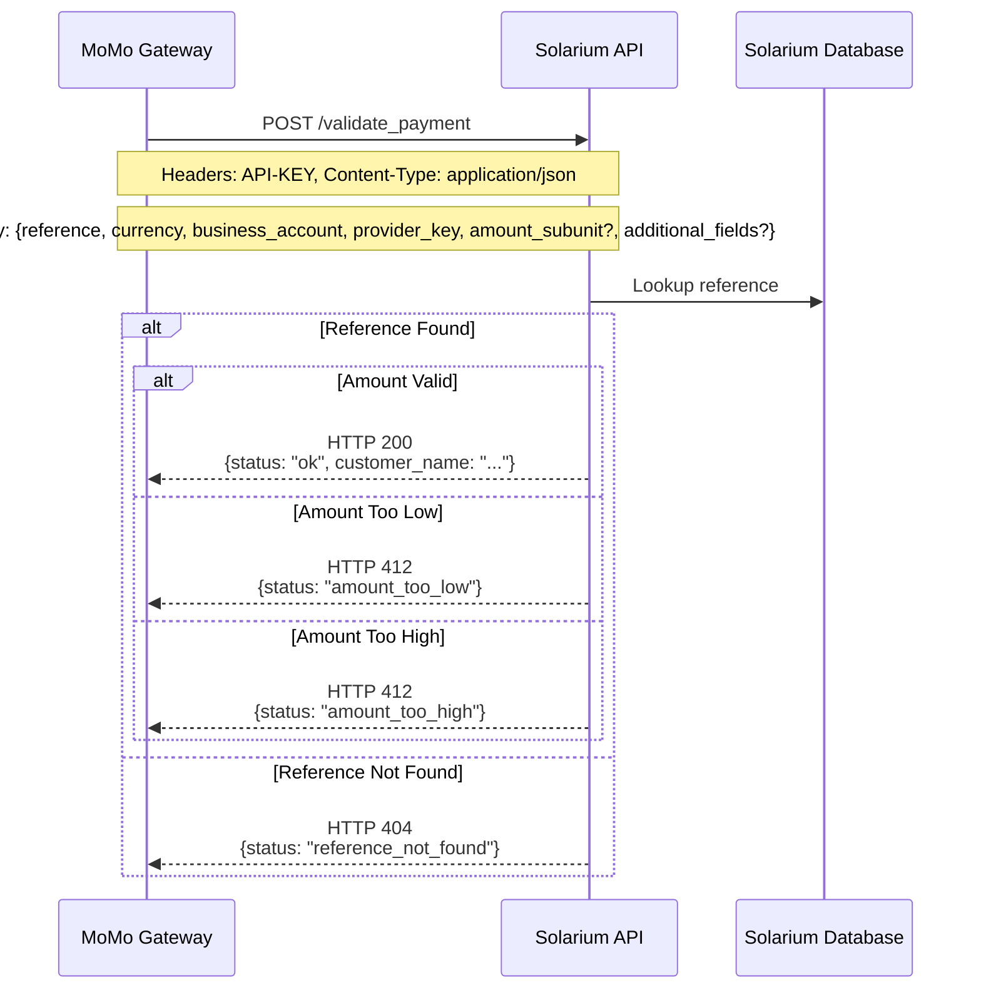
```mermaid
sequenceDiagram
    participant MoMo as MoMo Gateway
    participant Solarium as Solarium API
    participant DB as Solarium Database

    MoMo->>Solarium: POST /validate_payment
    Note over MoMo,Solarium: Headers: API-KEY, Content-Type: application/json
    Note over MoMo,Solarium: Body: {reference, currency, business_account, provider_key, amount_subunit?, additional_fields?}

    Solarium->>DB: Lookup reference

    alt Reference Found
        alt Amount Valid
            Solarium-->>MoMo: HTTP 200<br/>{status: "ok", customer_name: "..."}
        else Amount Too Low
            Solarium-->>MoMo: HTTP 412<br/>{status: "amount_too_low"}
        else Amount Too High
            Solarium-->>MoMo: HTTP 412<br/>{status: "amount_too_high"}
        end
    else Reference Not Found
        Solarium-->>MoMo: HTTP 404<br/>{status: "reference_not_found"}
    end
```

### Confirmation Flow

Payment confirmation with idempotency handling:

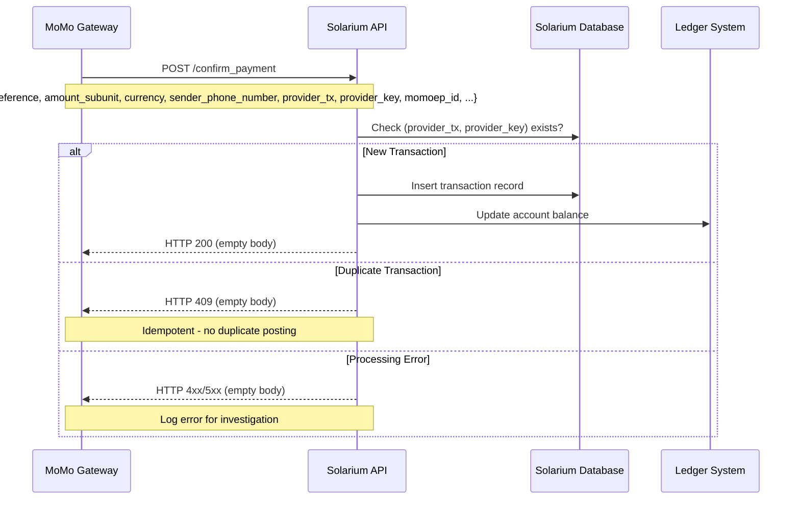
```mermaid
sequenceDiagram
    participant MoMo as MoMo Gateway
    participant Solarium as Solarium API
    participant DB as Solarium Database
    participant Ledger as Ledger System

    MoMo->>Solarium: POST /confirm_payment
    Note over MoMo,Solarium: Body: {reference, amount_subunit, currency, sender_phone_number, provider_tx, provider_key, momoep_id, ...}

    Solarium->>DB: Check (provider_tx, provider_key) exists?

    alt New Transaction
        Solarium->>DB: Insert transaction record
        Solarium->>Ledger: Update account balance
        Solarium-->>MoMo: HTTP 200 (empty body)
    else Duplicate Transaction
        Solarium-->>MoMo: HTTP 409 (empty body)
        Note over Solarium,MoMo: Idempotent - no duplicate posting
    else Processing Error
        Solarium-->>MoMo: HTTP 4xx/5xx (empty body)
        Note over Solarium,MoMo: Log error for investigation
    end
```

### M2M Device Flow

Device communication and command execution:

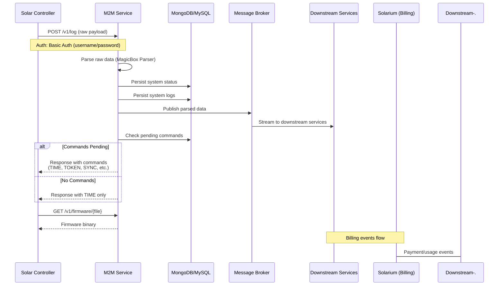
```mermaid
sequenceDiagram
    participant Device as Solar Controller
    participant M2M as M2M Service
    participant DB as MongoDB/MySQL
    participant Broker as Message Broker
    participant Downstream as Downstream Services
    participant Solarium as Solarium (Billing)

    Device->>M2M: POST /v1/log (raw payload)
    Note over Device,M2M: Auth: Basic Auth (username/password)

    M2M->>M2M: Parse raw data (MagicBox Parser)
    M2M->>DB: Persist system status
    M2M->>DB: Persist system logs
    M2M->>Broker: Publish parsed data

    Broker->>Downstream: Stream to downstream services

    M2M->>DB: Check pending commands

    alt Commands Pending
        M2M-->>Device: Response with commands<br/>(TIME, TOKEN, SYNC, etc.)
    else No Commands
        M2M-->>Device: Response with TIME only
    end

    Device->>M2M: GET /v1/firmware/{file}
    M2M-->>Device: Firmware binary

    Note over Downstream,Solarium: Billing events flow
    Downstream-.->Solarium: Payment/usage events
```

### Command Creation Flow

External service creating device commands:

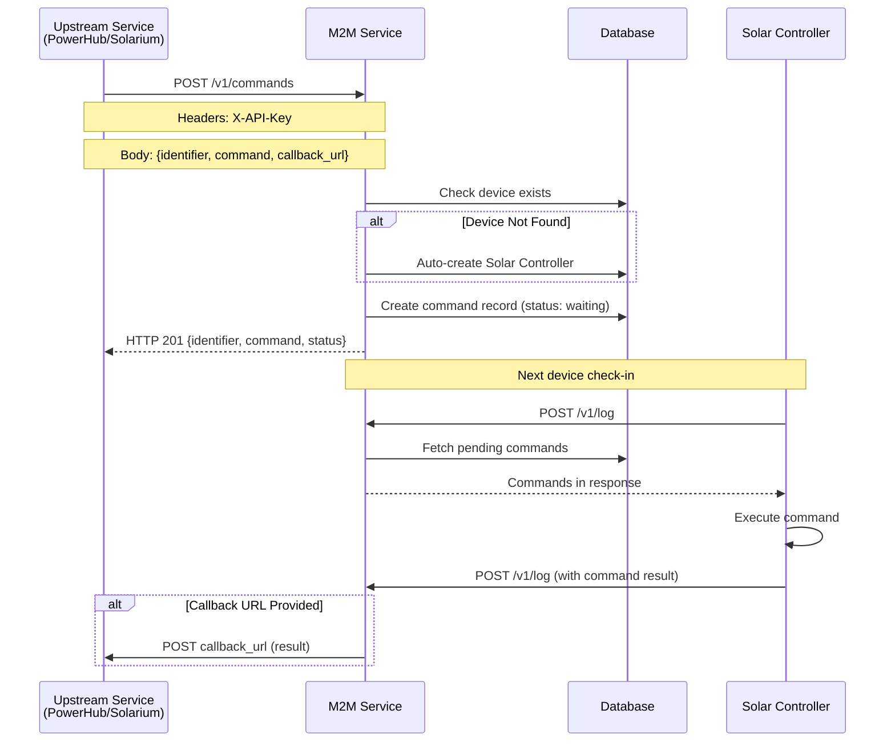
```mermaid
sequenceDiagram
    participant Upstream as Upstream Service<br/>(PowerHub/Solarium)
    participant M2M as M2M Service
    participant DB as Database
    participant Device as Solar Controller

    Upstream->>M2M: POST /v1/commands
    Note over Upstream,M2M: Headers: X-API-Key
    Note over Upstream,M2M: Body: {identifier, command, callback_url}

    M2M->>DB: Check device exists

    alt Device Not Found
        M2M->>DB: Auto-create Solar Controller
    end

    M2M->>DB: Create command record (status: waiting)
    M2M-->>Upstream: HTTP 201 {identifier, command, status}

    Note over M2M,Device: Next device check-in
    Device->>M2M: POST /v1/log
    M2M->>DB: Fetch pending commands
    M2M-->>Device: Commands in response

    Device->>Device: Execute command
    Device->>M2M: POST /v1/log (with command result)

    alt Callback URL Provided
        M2M->>Upstream: POST callback_url (result)
    end
```

---

## API Specifications

### Solarium Inbound APIs (from MoMo)

#### POST /validate_payment

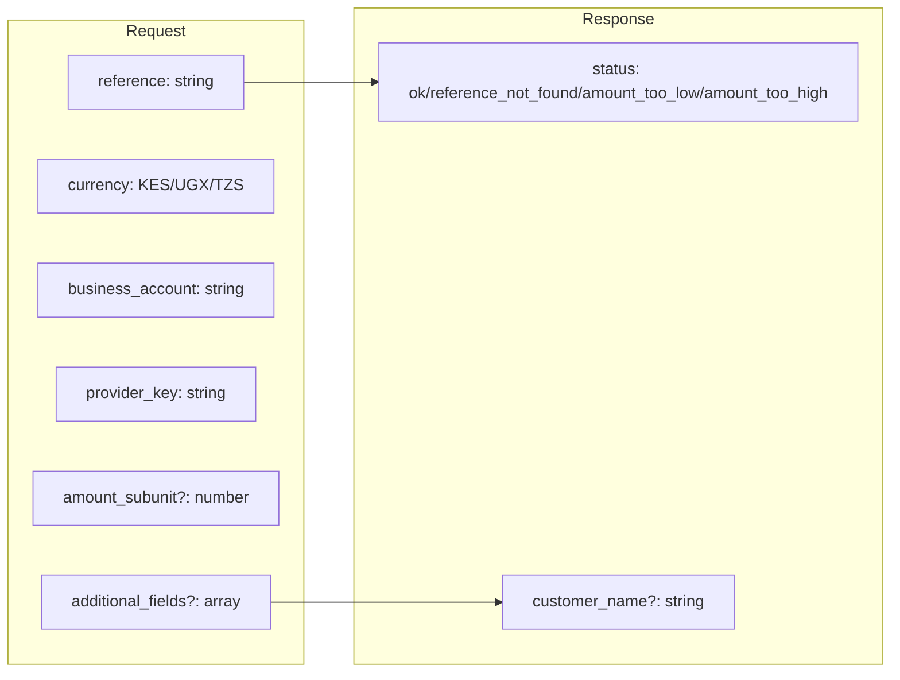
```mermaid
graph LR
    subgraph Request
        R1[reference: string]
        R2[currency: KES/UGX/TZS]
        R3[business_account: string]
        R4[provider_key: string]
        R5[amount_subunit?: number]
        R6[additional_fields?: array]
    end

    subgraph Response
        S1[status: ok/reference_not_found/amount_too_low/amount_too_high]
        S2[customer_name?: string]
    end

    R1 --> S1
    R6 --> S2
```

| Field | Required | Description |
|-------|----------|-------------|
| `reference` | Yes | Account/meter number |
| `currency` | Yes | ISO 4217 code |
| `business_account` | Yes | Target business (paybill) |
| `provider_key` | Yes | Format: `country_company_brand` |
| `amount_subunit` | No | Amount in cents (×100) |
| `additional_fields` | No | e.g., `["customer_name"]` |

#### POST /confirm_payment

| Field | Required | Description |
|-------|----------|-------------|
| `reference` | Yes | Account identifier |
| `amount_subunit` | Yes | Amount in cents |
| `currency` | Yes | ISO 4217 code |
| `sender_phone_number` | Yes | E.164 format (no +) |
| `provider_tx` | Yes | Provider transaction ref |
| `provider_key` | Yes | Provider identifier |
| `momoep_id` | Yes | MoMo database ID |
| `business_account` | Yes | Target business |
| `received_at` | Yes | UTC timestamp |

### Solarium Outbound APIs (External)

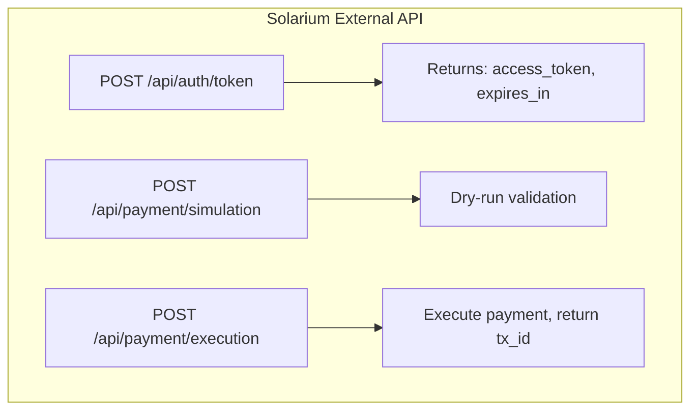
```mermaid
graph TB
    subgraph "Solarium External API"
        A[POST /api/auth/token] --> B[Returns: access_token, expires_in]
        C[POST /api/payment/simulation] --> D[Dry-run validation]
        E[POST /api/payment/execution] --> F[Execute payment, return tx_id]
    end
```

### M2M APIs

| Endpoint | Method | Auth | Purpose |
|----------|--------|------|---------|
| `/v1/ping` | GET | None | Health check |
| `/v1/log` | POST | Basic Auth | Device log upload |
| `/v1/firmware/{file}` | GET | None | Firmware download |
| `/v1/firmware/{file}/checksum` | GET | None | MD5 checksum |
| `/v1/commands` | POST | X-API-Key | Create device commands |

#### M2M Command Types

| Command | Description |
|---------|-------------|
| `unlock_token` | Unlock device with token code |
| `sync` | Synchronize device state |
| `synciv` | Sync initialization vector |
| `reset` | Reset device |
| `useracct` | User account operation |

#### M2M Command Endpoint (from Solarhub Feature Branch)

> **Note**: This endpoint is implemented in the `eead-692-solarium-m2m-api` branch by Boniface Ntarangwi and is not yet merged to master.

##### POST `/m2m/command`

| Aspect | Details |
|--------|---------|
| **Method** | POST |
| **Auth** | X-API-Key header (validates against `M2M_API_KEY` env var) |
| **Purpose** | Create device commands from external services |
| **Auto-create** | Device is auto-created if not found |

**Request Schema:**
```json
{
  "identifier": "SCBLNX/A/BT/240300126005",
  "callback_url": "https://your-service.com/webhook/m2m",
  "command": {
    "name": "unlock_token",
    "details": {
      "unlock_code": "123456789"
    }
  }
}
```

| Field | Required | Description |
|-------|----------|-------------|
| `identifier` | Yes | Device serial/identifier |
| `callback_url` | Yes | URL for status notifications |
| `command.name` | Yes | One of: `unlock_token`, `sync`, `synciv`, `reset`, `useracct` |
| `command.details` | Depends | Command-specific parameters (e.g., `unlock_code` for `unlock_token`) |

**Success Response (201 Created):**
```json
{
  "identifier": "SCBLNX/A/BT/240300126005",
  "command": "TOKEN: 123456789",
  "status": "created",
  "created_at": "2025-12-01T10:30:00Z"
}
```

**Error Responses:**

| Scenario | HTTP Code | Response |
|----------|-----------|----------|
| Missing API key | 401 | `{"error": "Unauthorized"}` |
| Invalid API key | 401 | `{"error": "Unauthorized"}` |
| Missing parameters | 400 | `{"error": "Missing parameters: identifier, callback_url"}` |
| Unsupported command | 400 | `{"error": "Unsupported command: invalid_cmd"}` |

#### M2M Callback Mechanism

When a command is executed on a device, the M2M service sends a callback to the registered URL.

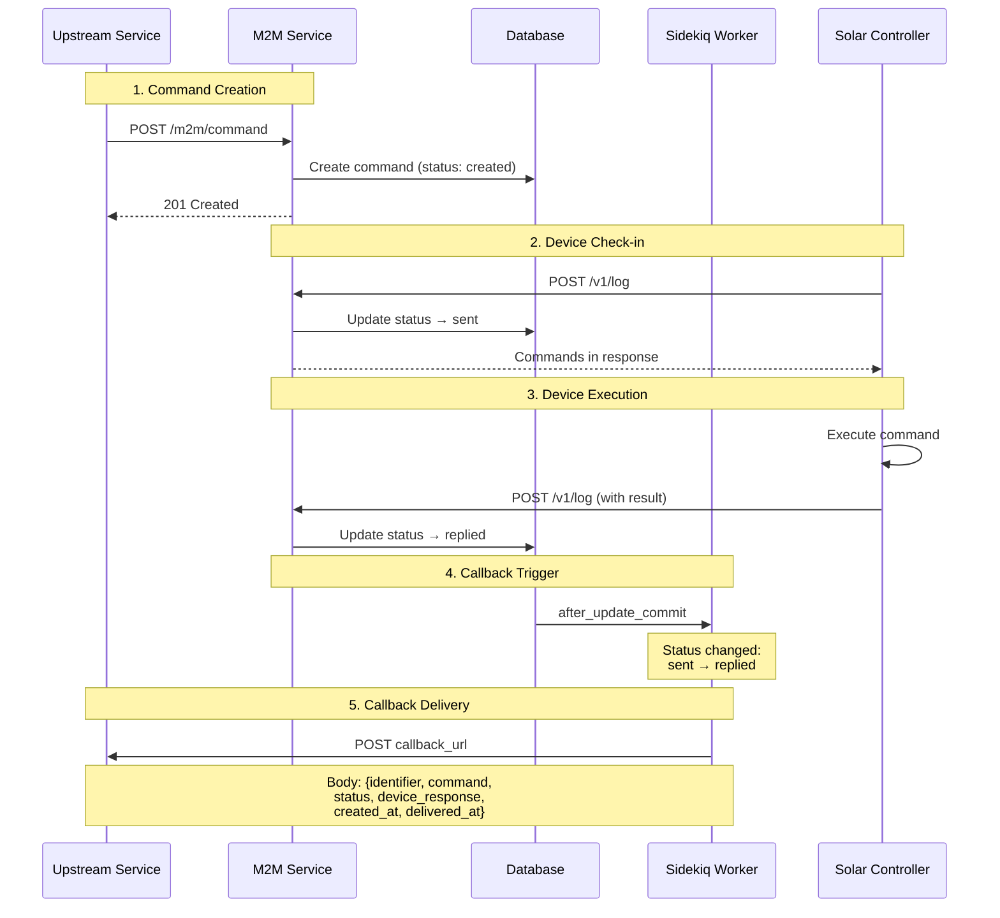
```mermaid
sequenceDiagram
    participant Upstream as Upstream Service
    participant M2M as M2M Service
    participant DB as Database
    participant Worker as Sidekiq Worker
    participant Device as Solar Controller

    Note over Upstream,M2M: 1. Command Creation
    Upstream->>M2M: POST /m2m/command
    M2M->>DB: Create command (status: created)
    M2M-->>Upstream: 201 Created

    Note over M2M,Device: 2. Device Check-in
    Device->>M2M: POST /v1/log
    M2M->>DB: Update status → sent
    M2M-->>Device: Commands in response

    Note over Device,M2M: 3. Device Execution
    Device->>Device: Execute command
    Device->>M2M: POST /v1/log (with result)
    M2M->>DB: Update status → replied

    Note over M2M,Worker: 4. Callback Trigger
    DB->>Worker: after_update_commit
    Note over Worker: Status changed:<br/>sent → replied

    Note over Worker,Upstream: 5. Callback Delivery
    Worker->>Upstream: POST callback_url
    Note over Worker,Upstream: Body: {identifier, command,<br/>status, device_response,<br/>created_at, delivered_at}
```

**Callback Payload (POST to callback_url):**
```json
{
  "identifier": "SCBLNX/A/BT/240300126005",
  "command": "TOKEN: 123456789",
  "status": "replied",
  "device_response": "OK",
  "created_at": "2025-12-01T10:30:00Z",
  "delivered_at": "2025-12-01T10:35:00Z"
}
```

**Callback Behavior:**
- Triggered when command status changes from `sent` → `replied`
- Uses Sidekiq for async processing with 10 retries
- 10-second timeout for HTTP requests
- Records `callback_delivered_at` on success
- Logs failures to Graylog before moving to Dead Job Queue

### Moto Token API (PAYG Token Generation)

The Moto service provides **OpenPAYGO Token** compatible APIs for generating device unlock tokens. There are two variants:

#### Endpoints

| Endpoint | Method | Auth | Purpose | Device Registration |
|----------|--------|------|---------|---------------------|
| `/api/v1/tokens/stateless/generate` | POST | API-KEY | Stateless token generation | **Not required** |
| `/api/v1/tokens/generate` | POST | API-KEY | Stateful token generation | **Required** |

> **Key Difference**: The **stateless** endpoint generates tokens without requiring prior device registration. The **stateful** endpoint requires the device to be registered first (returns `{"status":"device not found"}` otherwise).

#### Token Generation Flow

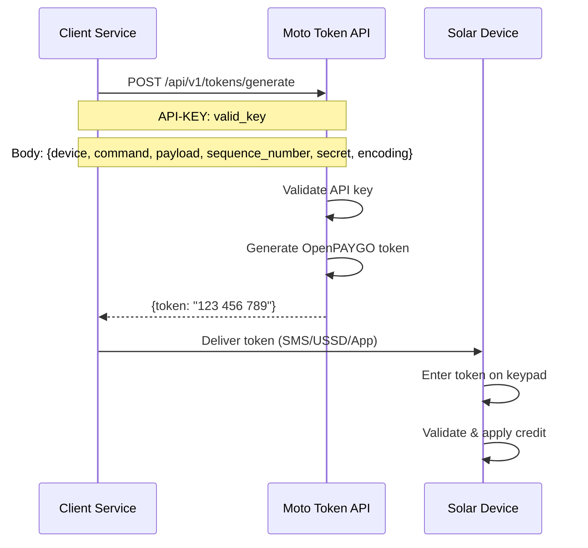
```mermaid
sequenceDiagram
    participant Client as Client Service
    participant Moto as Moto Token API
    participant Device as Solar Device

    Client->>Moto: POST /api/v1/tokens/generate
    Note over Client,Moto: API-KEY: valid_key
    Note over Client,Moto: Body: {device, command, payload, sequence_number, secret, encoding}

    Moto->>Moto: Validate API key
    Moto->>Moto: Generate OpenPAYGO token
    Moto-->>Client: {token: "123 456 789"}

    Client->>Device: Deliver token (SMS/USSD/App)
    Device->>Device: Enter token on keypad
    Device->>Device: Validate & apply credit
```

#### Request Schema

```json
{
    "device": "SCBLNX/A/BT/240300126005",
    "command": "unlock_relative",
    "payload": "10",
    "sequence_number": 1,
    "secret": "00112233AABBCC",
    "encoding": "*+0-9+#+pad3 space3"
}
```

| Field | Required | Description | Example |
|-------|----------|-------------|---------|
| `device` | Yes | Device serial/identifier | `"SCBLNX/A/BT/240300126005"` |
| `command` | Yes | Token command type | `"unlock_relative"` |
| `payload` | Yes | Command-specific value | `"10"` (days) |
| `sequence_number` | Yes | Token counter (anti-replay) | `1` |
| `secret` | Yes | Device secret key (hex) | `"00112233AABBCC"` |
| `encoding` | No | Output format for keypad entry | `"*+0-9+#+pad3 space3"` |

#### Available Commands (Confirmed via API Probing)

| Command | Status | Description | Payload | Example Response |
|---------|--------|-------------|---------|------------------|
| `unlock_relative` | **Supported** | Add days to current credit | Number of days | `{"status":"ok","token":"*00 427 443 49#","sequence_number":1}` |
| `unlock_absolute` | **Supported** | Set absolute end date | Days since activation | `{"status":"ok","token":"*15 311 916 41#","sequence_number":2}` |
| `counter_sync` | **Supported** | Sync token counter | Counter value | `{"status":"ok","token":"3367721144","sequence_number":5}` |
| `set_time` | Not Supported | Sync device time | - | `{"status":"Unsupported command set_time"}` |
| `disable` | Not Supported | Disable/lock device | - | `{"status":"Unsupported command disable"}` |
| `payg_disable` | Not Supported | Permanently disable PAYG | - | `{"status":"Unsupported command payg_disable"}` |
| `unlockinfinite` | Not Supported | Permanent unlock | - | `{"status":"Unsupported command unlockinfinite"}` |
| `free_credit` | Not Supported | Free credit mode | - | `{"status":"Unsupported command free_credit"}` |

#### Encoding Options (Confirmed via API Probing)

| Encoding | Output Format | Example Token | Notes |
|----------|---------------|---------------|-------|
| `*+0-9+#+pad3 space3` | Padded with `*`, `#`, spaces | `*00 427 443 49#` | Best for keypad entry |
| `*+0-9#` | With `*` prefix | `*126870056` | Standard keypad format |
| *(default/none)* | Plain numbers | `126443881` | No formatting |
| `numeric` | Plain numbers | *(empty response)* | May not be supported |
| *(invalid)* | - | *(empty response)* | Invalid encodings return empty |

#### Moto Staging Infrastructure

| Property | Value |
|----------|-------|
| **Host** | `moto-staging.plugintheworld.com` |
| **IP Address** | `138.201.53.68` |
| **Server** | nginx |
| **Framework** | Rails |
| **SSL Certificate** | Let's Encrypt (`*.plugintheworld.com`) |
| **Valid Until** | February 2026 |

#### Error Responses

| Scenario | HTTP Code | Response |
|----------|-----------|----------|
| Missing/Invalid API key (stateful) | 403 | `{"status":"not authorized"}` |
| Device not registered (stateful) | 404 | `{"status":"device not found"}` |
| Missing required fields | 200 | `{"status":"Identifier can't be blank, Command can't be blank, Sequence number can't be blank, and Secret hex can't be blank"}` |
| Unsupported command | 200 | `{"status":"Unsupported command <name>"}` |
| Invalid endpoint | 404 | Empty response |
| Service unavailable | 503 | HTML error page |

#### Validation Rules (Discovered)

| Field | Validation | Notes |
|-------|------------|-------|
| `device` | Required, any string | No format validation on stateless |
| `command` | Required, must be supported | See supported commands above |
| `payload` | Required for most commands | Accepts negative values (potential bug) |
| `sequence_number` | Required, integer >= 0 | `0` is valid |
| `secret` | Required, hex string | Short secrets accepted (no length validation) |
| `encoding` | Optional | Invalid values return empty response |

#### Stateless vs Stateful Comparison

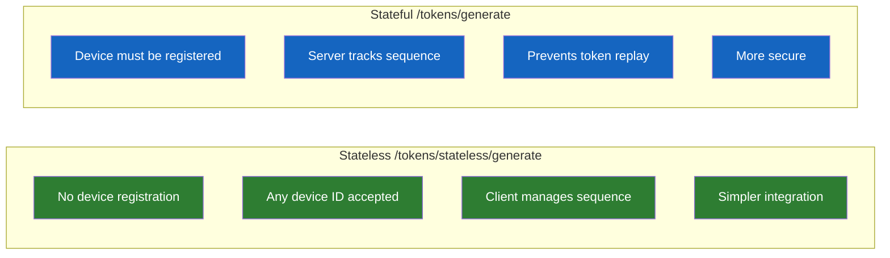
```mermaid
graph LR
    subgraph STATELESS["Stateless /tokens/stateless/generate"]
        S1[No device registration]
        S2[Any device ID accepted]
        S3[Client manages sequence]
        S4[Simpler integration]
    end

    subgraph STATEFUL["Stateful /tokens/generate"]
        T1[Device must be registered]
        T2[Server tracks sequence]
        T3[Prevents token replay]
        T4[More secure]
    end

    style S1 fill:#2E7D32,color:#fff
    style S2 fill:#2E7D32,color:#fff
    style S3 fill:#2E7D32,color:#fff
    style S4 fill:#2E7D32,color:#fff
    style T1 fill:#1565C0,color:#fff
    style T2 fill:#1565C0,color:#fff
    style T3 fill:#1565C0,color:#fff
    style T4 fill:#1565C0,color:#fff
```

---

## API Reconnaissance Findings

> **Note**: The following findings were obtained through live API probing of `https://solrm.com` on December 17, 2025.

### Infrastructure Analysis

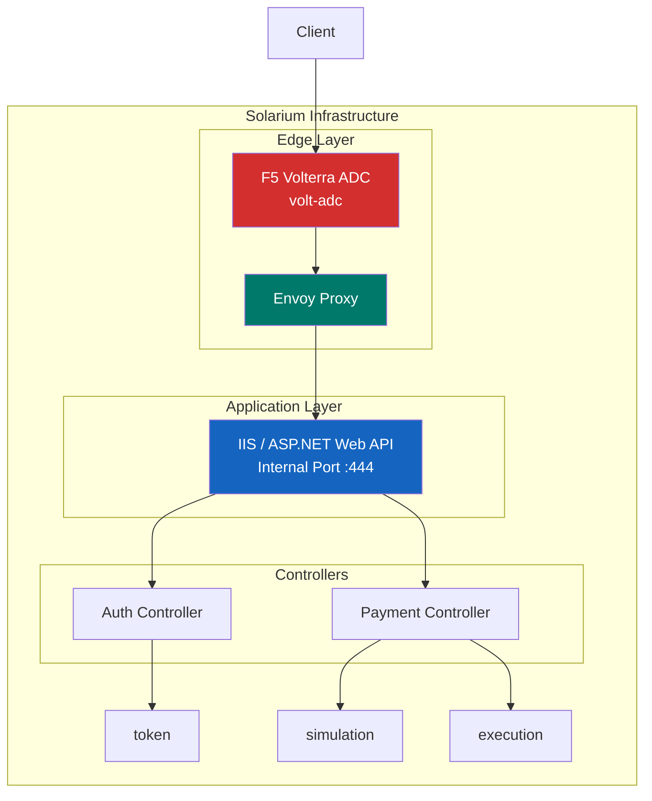
```mermaid
graph TB
    subgraph "Solarium Infrastructure"
        subgraph "Edge Layer"
            CDN[F5 Volterra ADC<br/>volt-adc]
            ENVOY[Envoy Proxy]
        end

        subgraph "Application Layer"
            IIS[IIS / ASP.NET Web API<br/>Internal Port :444]
        end

        subgraph "Controllers"
            AUTH[Auth Controller]
            PAY[Payment Controller]
        end

        AUTH --> TOKEN[token]
        PAY --> SIM[simulation]
        PAY --> EXEC[execution]
    end

    CLIENT[Client] --> CDN
    CDN --> ENVOY
    ENVOY --> IIS
    IIS --> AUTH
    IIS --> PAY

    style CDN fill:#D32F2F,color:#fff
    style ENVOY fill:#00796B,color:#fff
    style IIS fill:#1565C0,color:#fff
```

### Server Infrastructure Details

| Property | Value |
|----------|-------|
| **Domain** | `solrm.com` |
| **IP Address (IPv4)** | `159.60.132.116` |
| **IP Address (IPv6)** | `64:ff9b::9f3c:8474` |
| **Server** | `volt-adc` (F5 Volterra/Distributed Cloud) |
| **Data Center** | `dx1-dxb` (Dubai) |
| **Proxy** | Envoy (`x-envoy-upstream-service-time` header) |
| **Internal Port** | `:444` (revealed in error messages) |
| **Backend Framework** | ASP.NET Web API (IIS) |
| **Response Time** | ~180ms (upstream service time) |

### SSL/TLS Certificate

| Property | Value |
|----------|-------|
| **Subject** | `*.solrm.com` (wildcard) |
| **Issuer** | Sectigo RSA Domain Validation Secure Server CA |
| **Valid From** | March 9, 2025 |
| **Valid Until** | March 12, 2026 |
| **Type** | Domain Validation (DV) |

### Security Headers

| Header | Value | Assessment |
|--------|-------|------------|
| `Strict-Transport-Security` | `max-age=31536000; includeSubDomains` | Strong |
| `Content-Security-Policy` | `frame-ancestors 'none'` | Good (clickjacking protection) |
| `X-Frame-Options` | `DENY` | Good |
| `X-Content-Type-Options` | `nosniff` | Good |
| `Cache-Control` | `no-store` | Good (for auth endpoints) |
| `RateLimit-Policy` | `100;w=1` | 100 requests per window |

### Confirmed API Endpoints

#### Authentication Flow

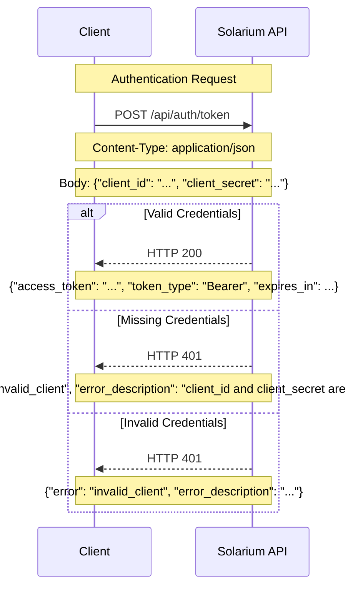
```mermaid
sequenceDiagram
    participant Client
    participant Solarium as Solarium API

    Note over Client,Solarium: Authentication Request
    Client->>Solarium: POST /api/auth/token
    Note over Client,Solarium: Content-Type: application/json
    Note over Client,Solarium: Body: {"client_id": "...", "client_secret": "..."}

    alt Valid Credentials
        Solarium-->>Client: HTTP 200
        Note over Solarium,Client: {"access_token": "...", "token_type": "Bearer", "expires_in": ...}
    else Missing Credentials
        Solarium-->>Client: HTTP 401
        Note over Solarium,Client: {"error": "invalid_client", "error_description": "client_id and client_secret are required"}
    else Invalid Credentials
        Solarium-->>Client: HTTP 401
        Note over Solarium,Client: {"error": "invalid_client", "error_description": "..."}
    end
```

#### POST `/api/auth/token`

| Aspect | Details |
|--------|---------|
| **Method** | POST only (GET returns 405) |
| **Content-Type** | `application/json` |
| **Purpose** | OAuth2-style token generation |
| **Auth Type** | Client Credentials (NOT Basic Auth) |

**Required Fields:**
```json
{
  "client_id": "<your_client_id>",
  "client_secret": "<your_client_secret>"
}
```

**Error Responses:**

| Scenario | HTTP Code | Response |
|----------|-----------|----------|
| Missing credentials | 401 | `{"error":"invalid_client","error_description":"client_id and client_secret are required"}` |
| Invalid credentials | 401 | `{"error":"invalid_client","error_description":"..."}` |
| Wrong HTTP method | 405 | `{"Message":"The requested resource does not support http method 'GET'."}` |

#### Payment Flow

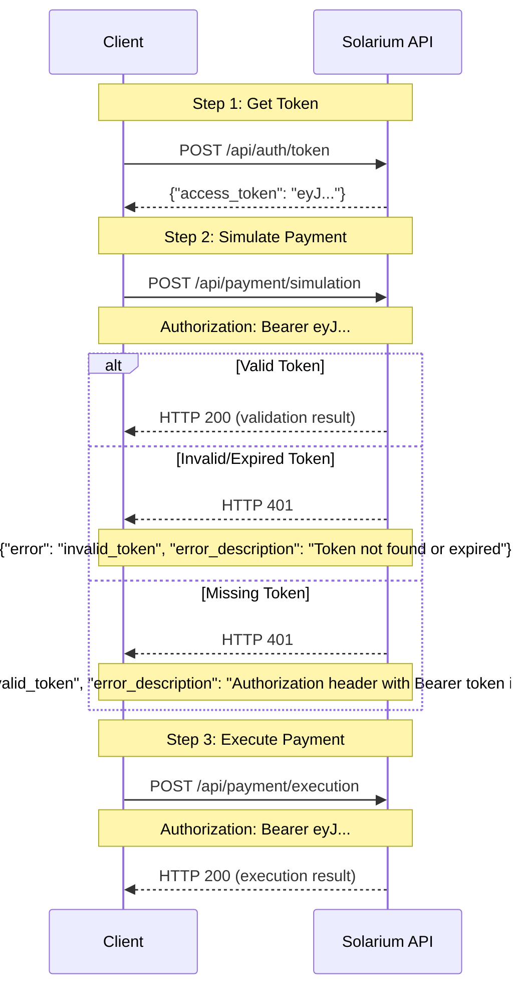
```mermaid
sequenceDiagram
    participant Client
    participant Solarium as Solarium API

    Note over Client,Solarium: Step 1: Get Token
    Client->>Solarium: POST /api/auth/token
    Solarium-->>Client: {"access_token": "eyJ..."}

    Note over Client,Solarium: Step 2: Simulate Payment
    Client->>Solarium: POST /api/payment/simulation
    Note over Client,Solarium: Authorization: Bearer eyJ...

    alt Valid Token
        Solarium-->>Client: HTTP 200 (validation result)
    else Invalid/Expired Token
        Solarium-->>Client: HTTP 401
        Note over Solarium,Client: {"error": "invalid_token", "error_description": "Token not found or expired"}
    else Missing Token
        Solarium-->>Client: HTTP 401
        Note over Solarium,Client: {"error": "invalid_token", "error_description": "Authorization header with Bearer token is required"}
    end

    Note over Client,Solarium: Step 3: Execute Payment
    Client->>Solarium: POST /api/payment/execution
    Note over Client,Solarium: Authorization: Bearer eyJ...
    Solarium-->>Client: HTTP 200 (execution result)
```

#### POST `/api/payment/simulation`

| Aspect | Details |
|--------|---------|
| **Method** | POST only |
| **Content-Type** | `application/json` |
| **Authorization** | `Bearer <access_token>` (required) |
| **Purpose** | Dry-run payment validation |

**Error Responses:**

| Scenario | HTTP Code | Response |
|----------|-----------|----------|
| Missing Authorization header | 401 | `{"error":"invalid_token","error_description":"Authorization header with Bearer token is required"}` |
| Invalid/Expired token | 401 | `{"error":"invalid_token","error_description":"Token not found or expired"}` |

#### POST `/api/payment/execution`

| Aspect | Details |
|--------|---------|
| **Method** | POST only |
| **Content-Type** | `application/json` |
| **Authorization** | `Bearer <access_token>` (required) |
| **Purpose** | Execute actual payment |

**Error Responses:** Same as `/api/payment/simulation`

### Controller Structure (Discovered)

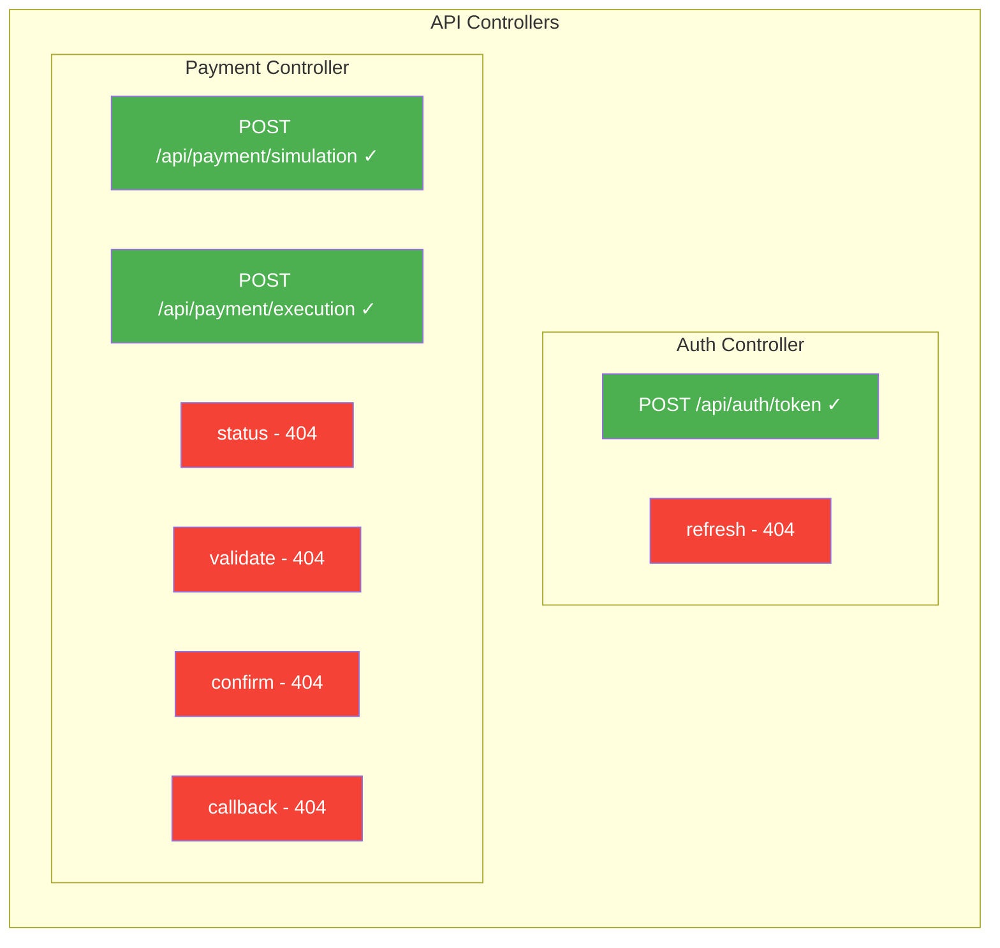
```mermaid
graph LR
    subgraph AC["API Controllers"]
        subgraph AUTH["Auth Controller"]
            A1["POST /api/auth/token ✓"]
            A2["refresh - 404"]
        end

        subgraph PAY["Payment Controller"]
            P1["POST /api/payment/simulation ✓"]
            P2["POST /api/payment/execution ✓"]
            P3["status - 404"]
            P4["validate - 404"]
            P5["confirm - 404"]
            P6["callback - 404"]
        end
    end

    style A1 fill:#4CAF50,color:#fff
    style P1 fill:#4CAF50,color:#fff
    style P2 fill:#4CAF50,color:#fff
    style A2 fill:#F44336,color:#fff
    style P3 fill:#F44336,color:#fff
    style P4 fill:#F44336,color:#fff
    style P5 fill:#F44336,color:#fff
    style P6 fill:#F44336,color:#fff
```

**Legend:** Green = Exists | Red = Not Found (404)

### HTTP Methods Analysis

| Endpoint | POST | GET | HEAD | OPTIONS | PUT | DELETE |
|----------|:----:|:---:|:----:|:-------:|:---:|:------:|
| `/api/auth/token` | 200/401 | 405 | 405 | 405 | 405 | 405 |
| `/api/payment/simulation` | 200/401 | 405 | 405 | 405 | 405 | 405 |
| `/api/payment/execution` | 200/401 | 405 | 405 | 405 | 405 | 405 |

### Rate Limiting

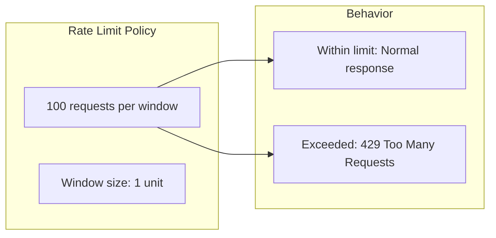
```mermaid
graph LR
    subgraph "Rate Limit Policy"
        R[100 requests per window]
        W[Window size: 1 unit]
    end

    subgraph "Behavior"
        B1[Within limit: Normal response]
        B2[Exceeded: 429 Too Many Requests]
    end

    R --> B1
    R --> B2
```

- **Policy**: `ratelimit-policy: 100;w=1`
- **Interpretation**: 100 requests per time window
- **Recommendation**: Implement exponential backoff for retries

### Inferred Request/Response Contracts

#### Complete Authentication + Payment Flow

```json
// Step 1: Authentication
// POST /api/auth/token
// Request:
{
  "client_id": "your_client_id",
  "client_secret": "your_client_secret"
}

// Response (inferred):
{
  "access_token": "eyJhbGciOiJIUzI1NiIsInR5cCI6IkpXVCJ9...",
  "token_type": "Bearer",
  "expires_in": 3600
}

// Step 2: Payment Simulation
// POST /api/payment/simulation
// Headers: Authorization: Bearer <access_token>
// Request (inferred):
{
  "reference": "account_number_or_meter",
  "amount": 5000,
  "currency": "UGX",
  "provider_key": "ug_mtn_mobilemoney"
}

// Response (inferred):
{
  "status": "ok",
  "customer_name": "John Doe",
  "validation_id": "sim_123456"
}

// Step 3: Payment Execution
// POST /api/payment/execution
// Headers: Authorization: Bearer <access_token>
// Request (inferred):
{
  "reference": "account_number_or_meter",
  "amount": 5000,
  "currency": "UGX",
  "provider_key": "ug_mtn_mobilemoney",
  "sender_phone": "256700000000",
  "validation_id": "sim_123456"
}

// Response (inferred):
{
  "status": "success",
  "transaction_id": "tx_789012",
  "provider_tx": "MOMO123456789"
}
```

### Key Discoveries Summary

| Discovery | Confidence | Implication |
|-----------|------------|-------------|
| OAuth2 Client Credentials flow | **Confirmed** | Must store `client_id` and `client_secret` securely |
| Bearer token authentication | **Confirmed** | Token must be passed in `Authorization` header |
| No refresh token endpoint | **Confirmed** | Tokens are single-use or time-limited; re-authenticate when expired |
| POST-only endpoints | **Confirmed** | All payment operations are POST |
| ASP.NET Web API backend | **Confirmed** | Error message format follows .NET conventions |
| F5 Volterra edge | **Confirmed** | Enterprise-grade DDoS protection and load balancing |
| Rate limiting active | **Confirmed** | 100 requests per window; implement backoff |
| Dubai data center | **Confirmed** | Low latency for Middle East/Africa regions |

### Endpoints NOT Found

The following endpoints were probed but do not exist:

- `/api/auth/refresh` - No token refresh mechanism
- `/api/payment/status` - No transaction status lookup
- `/api/payment/validate` - Validation done via `/simulation`
- `/api/payment/confirm` - Confirmation handled internally
- `/api/payment/callback` - No webhook endpoint discovered
- `/swagger/index.html` - No public API documentation
- `/api/health` - No health check endpoint
- `/api/version` - No version endpoint

---

## Possible Integrations

### Immediate Integrations

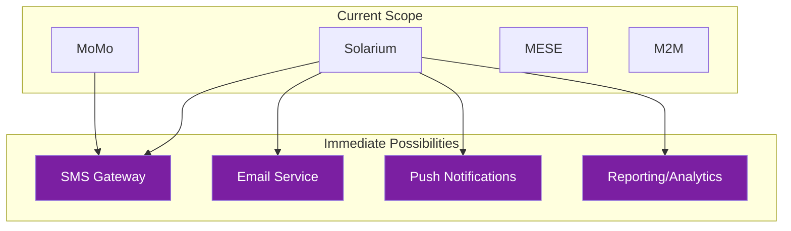
```mermaid
graph TB
    subgraph "Current Scope"
        S[Solarium]
        MO[MoMo]
        ME[MESE]
        M2[M2M]
    end

    subgraph "Immediate Possibilities"
        SMS[SMS Gateway]
        EMAIL[Email Service]
        PUSH[Push Notifications]
        REPORT[Reporting/Analytics]
    end

    S --> SMS
    S --> EMAIL
    S --> PUSH
    S --> REPORT
    MO --> SMS

    style SMS fill:#7B1FA2,color:#fff
    style EMAIL fill:#7B1FA2,color:#fff
    style PUSH fill:#7B1FA2,color:#fff
    style REPORT fill:#7B1FA2,color:#fff
```

### Future Integration Opportunities


```mermaid
graph TB
    subgraph "Core Platform"
        SOLAR[Solarium]
    end

    subgraph "Payment Providers"
        P1[Airtel Money]
        P2[Tigo Pesa]
        P3[Visa/Mastercard]
        P4[Bank Transfers]
        P5[Crypto Payments]
    end

    subgraph "Distribution Channels"
        C1[WhatsApp Business API]
        C2[Telegram Bot]
        C3[Mobile App SDK]
        C4[Web Widget]
        C5[POS Integration]
    end

    subgraph "Business Systems"
        B1[CRM Integration]
        B2[ERP Connector]
        B3[Accounting Software]
        B4[Inventory Management]
    end

    subgraph "Analytics & Intelligence"
        A1[BI Dashboard]
        A2[ML Fraud Detection]
        A3[Predictive Analytics]
        A4[Real-time Monitoring]
    end

    SOLAR --> P1
    SOLAR --> P2
    SOLAR --> P3
    SOLAR --> P4
    SOLAR --> P5

    SOLAR --> C1
    SOLAR --> C2
    SOLAR --> C3
    SOLAR --> C4
    SOLAR --> C5

    SOLAR --> B1
    SOLAR --> B2
    SOLAR --> B3
    SOLAR --> B4

    SOLAR --> A1
    SOLAR --> A2
    SOLAR --> A3
    SOLAR --> A4
```

### Integration Priority Matrix

| Integration | Impact | Effort | Priority |
|-------------|--------|--------|----------|
| Additional MoMo Providers | High | Medium | P1 |
| SMS/Notification Service | High | Low | P1 |
| WhatsApp Business API | Medium | Medium | P2 |
| Reporting Dashboard | Medium | Medium | P2 |
| Bank Transfer Gateway | High | High | P2 |
| Card Payments | Medium | High | P3 |
| CRM Integration | Low | Medium | P3 |

---

## Assumptions

### Technical Assumptions

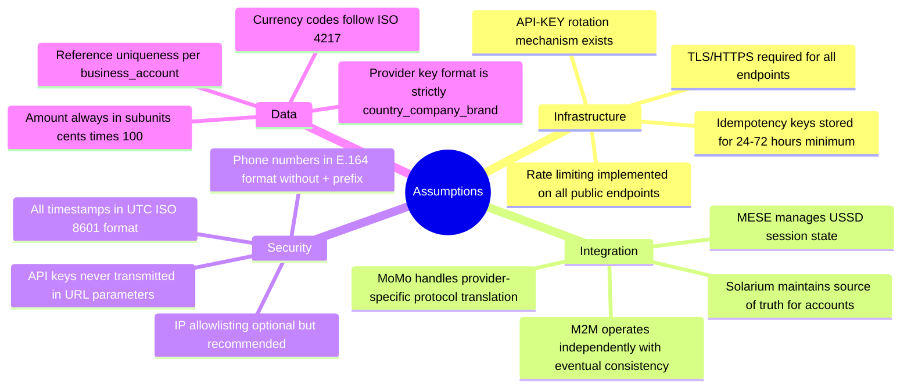
```mermaid
mindmap
  root((Assumptions))
    Infrastructure
      TLS/HTTPS required for all endpoints
      API-KEY rotation mechanism exists
      Rate limiting implemented on all public endpoints
      Idempotency keys stored for 24-72 hours minimum
    Integration
      MoMo handles provider-specific protocol translation
      MESE manages USSD session state
      Solarium maintains source of truth for accounts
      M2M operates independently with eventual consistency
    Security
      API keys never transmitted in URL parameters
      IP allowlisting optional but recommended
      All timestamps in UTC ISO 8601 format
      Phone numbers in E.164 format without + prefix
    Data
      Provider key format is strictly country_company_brand
      Amount always in subunits cents times 100
      Currency codes follow ISO 4217
      Reference uniqueness per business_account
```

### Business Assumptions

| Assumption | Risk if Invalid |
|------------|-----------------|
| Single currency per transaction | Multi-currency support would require schema changes |
| Synchronous validation acceptable | May need async validation for slow lookups |
| Provider confirms within 60 seconds | Timeout handling needed for delayed confirmations |
| Customer name optional | Some flows may require mandatory customer display |
| M2M billing events are eventual | Real-time billing would require architecture change |

### Operational Assumptions

- **Uptime SLA**: 99.9% availability target
- **Latency**: Validation < 2s, Confirmation < 5s
- **Throughput**: System handles peak of 1000 TPS
- **Retention**: Transaction logs retained for 7 years
- **Monitoring**: Graylog, Grafana, Sentry, Prometheus stack

---

## Baseline Understanding

### What We Know (Confirmed)

```mermaid
pie title Documentation Confidence Level
    "Fully Documented" : 45
    "Confirmed via Probing" : 35
    "Partially Documented" : 15
    "Inferred" : 5
```

#### Confirmed Details

| Area | Confidence | Source |
|------|------------|--------|
| MESE → MoMo → Solarium flow | High | Integration spec |
| Validation/Confirmation API contracts | High | Integration spec |
| M2M API specification | High | RFC document |
| Provider key format | High | Both documents |
| Error handling patterns | Medium | Integration spec |
| Security requirements | Medium | Both documents |
| **Solarium OAuth2 Client Credentials flow** | **High** | **API Probing** |
| **Bearer token authentication required** | **High** | **API Probing** |
| **POST-only endpoints** | **High** | **API Probing** |
| **No refresh token endpoint** | **High** | **API Probing** |
| **F5 Volterra ADC infrastructure** | **High** | **API Probing** |
| **ASP.NET Web API backend** | **High** | **API Probing** |
| **Rate limiting (100 req/window)** | **High** | **API Probing** |
| **Dubai data center (dx1-dxb)** | **High** | **API Probing** |

### What We Inferred

| Inference | Basis | Confidence |
|-----------|-------|------------|
| ~~`/api/auth/token` returns OAuth2-style tokens~~ | ~~Standard API patterns~~ | ~~Medium~~ **CONFIRMED** |
| ~~`/api/payment/simulation` does dry-run validation~~ | ~~Naming convention~~ | ~~Medium~~ **CONFIRMED** |
| ~~`/api/payment/execution` triggers actual payment~~ | ~~Naming convention~~ | ~~Medium~~ **CONFIRMED** |
| Token response includes `access_token`, `token_type`, `expires_in` | Standard OAuth2 | Medium |
| Payment request body structure | MoMo integration spec alignment | Medium |
| M2M sends billing events to Solarium | Architecture context | Low |

### Knowledge Gaps

```mermaid
graph TD
    subgraph "Resolved via API Probing"
        R1[Auth mechanism - OAuth2 Client Credentials]
        R2[Token type - Bearer]
        R3[Infrastructure - F5 Volterra + ASP.NET]
        R4[Rate limiting - 100/window]
    end

    subgraph "Still Unknown / Needs Clarification"
        G1[Exact token expiration time]
        G2[Payment request body schema]
        G3[Payment response body schema]
        G4[Webhook/callback configuration]
        G5[Multi-tenancy data isolation strategy]
        G6[Disaster recovery procedures]
        G7[M2M to Solarium billing event format]
    end

    style R1 fill:#2E7D32,color:#fff
    style R2 fill:#2E7D32,color:#fff
    style R3 fill:#2E7D32,color:#fff
    style R4 fill:#2E7D32,color:#fff
    style G1 fill:#C62828,color:#fff
    style G2 fill:#C62828,color:#fff
    style G3 fill:#C62828,color:#fff
    style G4 fill:#C62828,color:#fff
    style G5 fill:#C62828,color:#fff
    style G6 fill:#C62828,color:#fff
    style G7 fill:#C62828,color:#fff
```

### Recommended Next Steps

1. **Obtain Solarium external API documentation** (`/api/auth/token`, `/api/payment/*`)
2. **Clarify M2M ↔ Solarium integration** for billing events
3. **Define retry and timeout policies** for all integration points
4. **Document webhook/callback specifications** for async notifications
5. **Create sandbox/staging environments** for integration testing

---

## Status

| Phase | Status | Notes |
|-------|--------|-------|
| Requirements Analysis | Complete | Based on provided documents |
| Architecture Design | Complete | Diagrams created |
| API Specification | **In Progress** | MoMo callbacks documented; Solarium external API **partially confirmed via probing** |
| API Reconnaissance | **Complete** | Live probing of `solrm.com` completed |
| Implementation | Not Started | - |
| Testing | Not Started | Test cases defined in spec |
| Deployment | Not Started | - |

### Recent Updates

| Date | Update |
|------|--------|
| 2025-12-18 | Added M2M command endpoint documentation from Boniface's feature branch |
| 2025-12-18 | Documented M2M callback mechanism with Sidekiq worker |
| 2025-12-18 | Added Moto stateless API supported commands |
| 2025-12-17 | Added API reconnaissance findings from live probing |
| 2025-12-17 | Confirmed OAuth2 Client Credentials flow |
| 2025-12-17 | Documented infrastructure (F5 Volterra, ASP.NET, Dubai DC) |
| 2025-12-17 | Confirmed rate limiting policy (100 req/window) |
| 2025-12-17 | Updated confidence levels based on confirmed data |

---

## References

- Solarium USSD ↔ MoMo Integration Spec (attached)
- M2M Microservice RFC (attached)
- [MoMo API Documentation](#) (external)
- [MESE Configuration Guide](#) (external)
- **Live API**: `https://solrm.com/api/` (probed December 2025)

---

## License

Proprietary - Internal Use Only

---

*Documentation generated: December 2025*
*Last updated: December 18, 2025 (M2M command endpoint and callback documentation added)*
