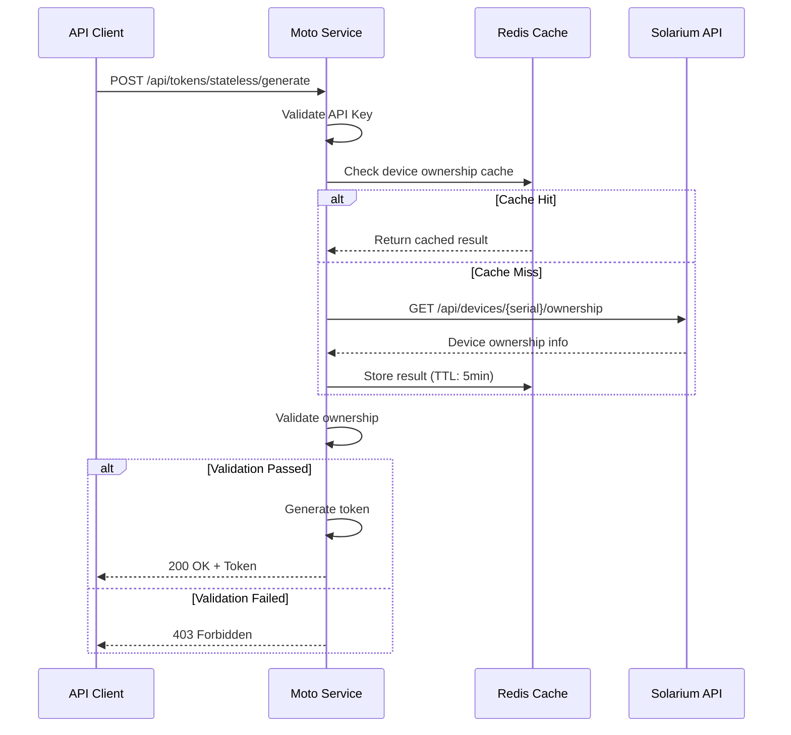

# Device Ownership Validation Technical Specification

**Service:** Moto (Token Generation Service)
**Version:** 1.0
**Author:** Eric Gitangu (QA Lead)
**Date:** December 31, 2025
**Status:** Draft - For Review

---

## 1. Executive Summary

This specification defines the device ownership validation mechanism for the Moto token generation service. The goal is to prevent unauthorized token generation by validating that the requesting client has legitimate ownership or authorization over the target device before generating unlock tokens.

### 1.1 Problem Statement

Currently, the stateless token generation endpoint (`/api/tokens/stateless/generate`) can generate tokens for any device serial number without verifying ownership. This creates potential security risks:

- Unauthorized parties could generate tokens for devices they don't own
- No audit trail linking token generation to authorized API clients
- No rate limiting per device to prevent token farming

### 1.2 Proposed Solution

Implement a device ownership validation layer that:

1. Validates the API client's authorization to generate tokens for specific devices
2. Queries Solarium to verify device-customer relationships
3. Maintains a local cache for performance
4. Logs all token generation attempts for audit

---

## 2. Requirements

### 2.1 Functional Requirements

| ID | Requirement | Priority |
|----|-------------|----------|
| FR-01 | Validate device serial exists in the system | High |
| FR-02 | Verify API client is authorized for the device's market | High |
| FR-03 | Verify device is not flagged as stolen/lost | High |
| FR-04 | Return appropriate error codes for validation failures | High |
| FR-05 | Cache validation results for performance | Medium |
| FR-06 | Log all validation attempts with outcome | Medium |
| FR-07 | Support bypass for emergency/support scenarios | Low |

### 2.2 Non-Functional Requirements

| ID | Requirement | Target |
|----|-------------|--------|
| NFR-01 | Validation latency | < 100ms (cached), < 500ms (uncached) |
| NFR-02 | Cache TTL | 5 minutes |
| NFR-03 | Availability | 99.9% |
| NFR-04 | Rate limiting | 100 requests/minute per API client |

---

## 3. Technical Design

### 3.1 Architecture Overview

```
┌──────────────┐     ┌──────────────┐     ┌──────────────┐
│   MoMoEP/    │     │    Moto      │     │  Solarium    │
│   M2M/App    │────▶│   Service    │────▶│    API       │
└──────────────┘     └──────────────┘     └──────────────┘
                            │
                            ▼
                     ┌──────────────┐
                     │    Redis     │
                     │   (Cache)    │
                     └──────────────┘
```

### 3.2 Validation Flow



### 3.3 API Endpoint Changes

#### 3.3.1 Updated Token Generation Endpoint

**Endpoint:** `POST /api/tokens/stateless/generate`

**Request Headers:**
```
X-API-Key: <api_key>
Content-Type: application/json
```

**Request Body:**
```json
{
  "serial_number": "SCBLNX/A/BT/240300126005",
  "days": 30,
  "hours": 0
}
```

**Success Response (200):**
```json
{
  "token": "1234567890123456",
  "serial_number": "SCBLNX/A/BT/240300126005",
  "days": 30,
  "hours": 0,
  "expires_at": "2026-01-30T10:00:00Z",
  "validated": true,
  "validation_source": "cache"
}
```

**Validation Error Response (403):**
```json
{
  "error": "device_ownership_validation_failed",
  "message": "API client is not authorized to generate tokens for this device",
  "details": {
    "serial_number": "SCBLNX/A/BT/240300126005",
    "reason": "device_not_in_client_market"
  }
}
```

**Device Not Found Response (404):**
```json
{
  "error": "device_not_found",
  "message": "Device with the specified serial number was not found"
}
```

#### 3.3.2 New Validation Endpoint

**Endpoint:** `GET /api/devices/{serial}/validate-ownership`

**Purpose:** Explicit ownership validation without token generation

**Response (200):**
```json
{
  "serial_number": "SCBLNX/A/BT/240300126005",
  "valid": true,
  "market": "KE",
  "customer_id": "cust_12345",
  "device_status": "active",
  "validation_timestamp": "2025-12-31T10:00:00Z"
}
```

### 3.4 Data Model

#### 3.4.1 Device Ownership Record

```ruby
# app/models/device_ownership.rb
class DeviceOwnership
  include Mongoid::Document

  field :serial_number, type: String
  field :market_code, type: String
  field :customer_id, type: String
  field :device_status, type: String  # active, suspended, stolen, lost
  field :authorized_clients, type: Array  # API client IDs
  field :last_validated_at, type: DateTime
  field :validation_source, type: String  # solarium, cache, manual

  index({ serial_number: 1 }, { unique: true })
  index({ market_code: 1 })
  index({ customer_id: 1 })
end
```

#### 3.4.2 Validation Audit Log

```ruby
# app/models/validation_audit_log.rb
class ValidationAuditLog
  include Mongoid::Document

  field :serial_number, type: String
  field :api_client_id, type: String
  field :validation_result, type: String  # passed, failed
  field :failure_reason, type: String
  field :ip_address, type: String
  field :request_timestamp, type: DateTime
  field :response_time_ms, type: Integer

  index({ serial_number: 1, request_timestamp: -1 })
  index({ api_client_id: 1, request_timestamp: -1 })
end
```

### 3.5 Service Implementation

#### 3.5.1 Ownership Validation Service

```ruby
# app/services/device_ownership_validator.rb
class DeviceOwnershipValidator
  CACHE_TTL = 5.minutes
  CACHE_KEY_PREFIX = "device_ownership:"

  def initialize(api_client:, serial_number:)
    @api_client = api_client
    @serial_number = serial_number
  end

  def validate!
    result = cached_validation || fetch_from_solarium

    log_validation_attempt(result)

    raise UnauthorizedDeviceError, result[:reason] unless result[:valid]

    result
  end

  private

  def cached_validation
    cached = Rails.cache.read(cache_key)
    return nil unless cached

    {
      valid: validate_ownership(cached),
      source: "cache",
      data: cached
    }
  end

  def fetch_from_solarium
    response = SolariumClient.get_device_ownership(@serial_number)

    Rails.cache.write(cache_key, response, expires_in: CACHE_TTL)

    {
      valid: validate_ownership(response),
      source: "solarium",
      data: response
    }
  end

  def validate_ownership(device_data)
    return false if device_data[:status].in?(%w[stolen lost suspended])
    return false unless @api_client.authorized_markets.include?(device_data[:market])
    true
  end

  def cache_key
    "#{CACHE_KEY_PREFIX}#{@serial_number}"
  end

  def log_validation_attempt(result)
    ValidationAuditLog.create!(
      serial_number: @serial_number,
      api_client_id: @api_client.id,
      validation_result: result[:valid] ? "passed" : "failed",
      failure_reason: result[:reason],
      ip_address: RequestStore[:client_ip],
      request_timestamp: Time.current
    )
  end
end
```

#### 3.5.2 Solarium Client

```ruby
# app/clients/solarium_client.rb
class SolariumClient
  include HTTParty
  base_uri ENV.fetch('SOLARIUM_BASE_URL')

  class << self
    def get_device_ownership(serial_number)
      response = get(
        "/api/devices/#{CGI.escape(serial_number)}/ownership",
        headers: auth_headers,
        timeout: 5
      )

      handle_response(response)
    end

    private

    def auth_headers
      {
        "X-API-Key" => ENV.fetch('SOLARIUM_API_KEY'),
        "Content-Type" => "application/json"
      }
    end

    def handle_response(response)
      case response.code
      when 200
        JSON.parse(response.body, symbolize_names: true)
      when 404
        raise DeviceNotFoundError, "Device not found in Solarium"
      else
        raise SolariumApiError, "Solarium API error: #{response.code}"
      end
    end
  end
end
```

### 3.6 Configuration

```yaml
# config/device_ownership.yml
default: &default
  cache_ttl_seconds: 300
  validation_enabled: true
  bypass_for_support: false
  rate_limit_per_client: 100
  rate_limit_window_seconds: 60

development:
  <<: *default
  validation_enabled: false  # Disable in dev for easier testing

test:
  <<: *default
  cache_ttl_seconds: 1
  validation_enabled: true

staging:
  <<: *default

production:
  <<: *default
  bypass_for_support: true  # Allow support team bypass
```

---

## 4. Error Handling

### 4.1 Error Codes

| Code | Error | HTTP Status | Description |
|------|-------|-------------|-------------|
| `device_not_found` | Device Not Found | 404 | Serial number not in system |
| `device_ownership_validation_failed` | Unauthorized | 403 | API client not authorized for device |
| `device_status_invalid` | Forbidden | 403 | Device is stolen/lost/suspended |
| `validation_service_unavailable` | Service Error | 503 | Cannot reach Solarium |
| `rate_limit_exceeded` | Too Many Requests | 429 | Client exceeded rate limit |

### 4.2 Error Response Format

```json
{
  "error": "error_code",
  "message": "Human readable message",
  "details": {
    "serial_number": "...",
    "reason": "specific_reason",
    "retry_after": 60
  }
}
```

---

## 5. Testing

### 5.1 Unit Tests

```ruby
# spec/services/device_ownership_validator_spec.rb
RSpec.describe DeviceOwnershipValidator do
  let(:api_client) { create(:api_client, authorized_markets: ["KE"]) }
  let(:serial_number) { "SCBLNX/A/BT/240300126005" }

  describe "#validate!" do
    context "when device is in authorized market" do
      before do
        allow(SolariumClient).to receive(:get_device_ownership)
          .and_return({ market: "KE", status: "active" })
      end

      it "returns valid result" do
        validator = described_class.new(api_client: api_client, serial_number: serial_number)
        result = validator.validate!
        expect(result[:valid]).to be true
      end
    end

    context "when device is in unauthorized market" do
      before do
        allow(SolariumClient).to receive(:get_device_ownership)
          .and_return({ market: "UG", status: "active" })
      end

      it "raises UnauthorizedDeviceError" do
        validator = described_class.new(api_client: api_client, serial_number: serial_number)
        expect { validator.validate! }.to raise_error(UnauthorizedDeviceError)
      end
    end

    context "when device is marked as stolen" do
      before do
        allow(SolariumClient).to receive(:get_device_ownership)
          .and_return({ market: "KE", status: "stolen" })
      end

      it "raises UnauthorizedDeviceError" do
        validator = described_class.new(api_client: api_client, serial_number: serial_number)
        expect { validator.validate! }.to raise_error(UnauthorizedDeviceError)
      end
    end
  end
end
```

### 5.2 Integration Tests

```ruby
# spec/integration/device_ownership_validation_spec.rb
RSpec.describe "Device Ownership Validation", type: :request do
  let(:api_key) { create(:api_client, authorized_markets: ["KE"]).api_key }
  let(:headers) { { "X-API-Key" => api_key, "Content-Type" => "application/json" } }

  describe "POST /api/tokens/stateless/generate" do
    context "with valid ownership" do
      before do
        stub_solarium_ownership(market: "KE", status: "active")
      end

      it "generates token successfully" do
        post "/api/tokens/stateless/generate",
          params: { serial_number: "TEST123", days: 30 }.to_json,
          headers: headers

        expect(response).to have_http_status(:ok)
        expect(json_response["token"]).to be_present
      end
    end

    context "with invalid ownership" do
      before do
        stub_solarium_ownership(market: "UG", status: "active")
      end

      it "returns 403 forbidden" do
        post "/api/tokens/stateless/generate",
          params: { serial_number: "TEST123", days: 30 }.to_json,
          headers: headers

        expect(response).to have_http_status(:forbidden)
        expect(json_response["error"]).to eq("device_ownership_validation_failed")
      end
    end
  end
end
```

---

## 6. Rollout Plan

### 6.1 Phase 1: Monitoring Mode (Week 1)

- Deploy validation logic in monitoring mode
- Log all validation results without blocking requests
- Analyze failure patterns and false positives

### 6.2 Phase 2: Soft Enforcement (Week 2)

- Enable validation for new API clients only
- Existing clients continue with legacy behavior
- Monitor error rates and client feedback

### 6.3 Phase 3: Full Enforcement (Week 3)

- Enable validation for all API clients
- Maintain support bypass for emergency scenarios
- Full audit logging enabled

---

## 7. Monitoring and Alerting

### 7.1 Metrics

| Metric | Description | Alert Threshold |
|--------|-------------|-----------------|
| `validation_latency_p95` | 95th percentile latency | > 500ms |
| `validation_failure_rate` | % of failed validations | > 10% |
| `cache_hit_rate` | % of cached validations | < 80% |
| `solarium_error_rate` | % of Solarium API errors | > 1% |

### 7.2 Dashboards

- Validation success/failure rates by market
- Latency distribution
- Top API clients by validation failures
- Device status distribution

---

## 8. Appendix

### 8.1 Market Codes

| Market | Code | Currency |
|--------|------|----------|
| Kenya | KE | KES |
| Uganda | UG | UGX |
| Rwanda | RW | RWF |
| Tanzania | TZ | TZS |
| Nigeria | NG | NGN |
| Zambia | ZM | ZMW |
| Benin | BJ | XOF |
| Ivory Coast | CI | XOF |
| Mozambique | MZ | MZN |

### 8.2 Device Status Values

| Status | Description | Token Generation |
|--------|-------------|------------------|
| `active` | Normal operation | Allowed |
| `suspended` | Temporarily suspended | Blocked |
| `stolen` | Reported stolen | Blocked |
| `lost` | Reported lost | Blocked |
| `decommissioned` | End of life | Blocked |
