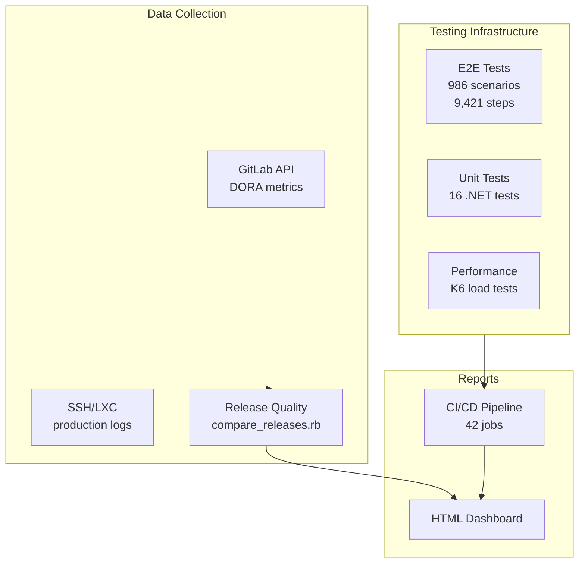
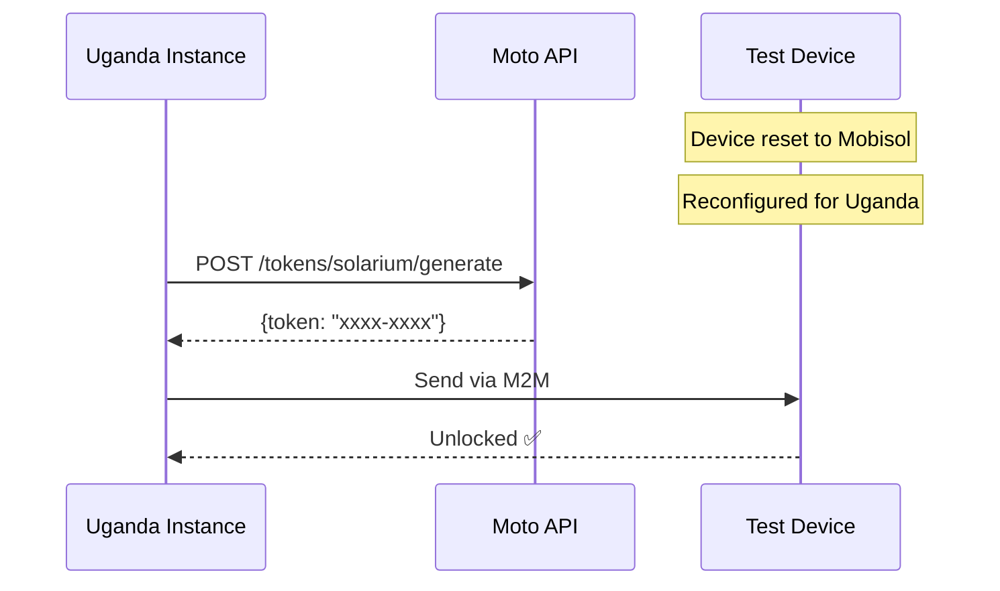

# Release Quality & Testing Framework

## Stakeholder Brief for Engineering Leadership

**Document Type:** Foundational Technical Brief
**Prepared by:** Eric Gitangu, QA Lead
**For:** Bineyame AFEWORK, Head of Software Engineering
**Date:** December 31, 2025
**Status:** Production-Ready
**Meeting:** 1:1 scheduled for 5:30 AM EAT (January 1, 2026)

---

## Quick Links

| Resource | Link |
|----------|------|
| QA Wiki | [git.plugintheworld.com/db-dev/qa/-/wikis](https://git.plugintheworld.com/db-dev/qa/-/wikis) |
| E2E Tests (AFAT-2290) | [solarhub/script/eric/e2e_perf](https://git.plugintheworld.com/db-dev/solarhub/-/tree/AFAT-2290-E2E/script/eric/e2e_perf) |
| Release Quality | [solarhub/script/eric/release_quality](https://git.plugintheworld.com/db-dev/solarhub/-/blob/master/script/eric/release_quality/README.md) |
| Testing Strategy | [qa.wiki/testing](https://git.plugintheworld.com/db-dev/qa/-/wikis/testing/README) |
| CI/CD Setup | [qa.wiki/guides/ci](https://git.plugintheworld.com/db-dev/qa/-/wikis/guides/ci/ci-cd-setup) |
| Moto API | [db-dev/moto](https://git.plugintheworld.com/db-dev/moto) |
| QA Dashboard | [github.com/ericgitangu/engie-powerhub-qa](https://github.com/ericgitangu/engie-powerhub-qa) |
| **M-Services CI Templates** | [db-dev/qa/m-services-ci](https://git.plugintheworld.com/db-dev/qa/-/tree/qa_uat/m-services-ci) |
| **PayGoHub PoC (GitLab)** | [db-dev/qa/paygohub](https://git.plugintheworld.com/db-dev/qa/-/tree/qa_uat/paygohub) |
| **PayGoHub PoC (GitHub)** | [github.com/ericgitangu/PayGoHub](https://github.com/ericgitangu/PayGoHub) |
| **PayGoHub Live** | [paygohub-web-qa.fly.dev](https://paygohub-web-qa.fly.dev) |
| **PayGoHub API Docs** | [paygohub-web-qa.fly.dev/api-docs](https://paygohub-web-qa.fly.dev/api-docs) |
| **PayGoHub OpenAPI (GitHub)** | [github.com/ericgitangu/PayGoHub/docs/api](https://github.com/ericgitangu/PayGoHub/blob/master/docs/api/paygohub-openapi.yml) |

---

## Context: Pilot Migration Project

This document addresses the QA infrastructure supporting the **pilot migration from existing PowerHub systems to SOLRM (Solarium)**. The migration affects **all 7 production markets**.

### Scope: All Production Markets

| Market | Code | E2E Coverage | Release Quality | Device Testing |
|--------|------|--------------|-----------------|----------------|
| **Uganda** | UG | [986 scenarios](https://git.plugintheworld.com/db-dev/solarhub/-/tree/AFAT-2290-E2E/script/eric/e2e_perf/tests/features) | ✅ Active | **Active** |
| Benin | BJ | [986 scenarios](https://git.plugintheworld.com/db-dev/solarhub/-/tree/AFAT-2290-E2E/script/eric/e2e_perf/tests/features) | ✅ Active | - |
| Ivory Coast | CI | [986 scenarios](https://git.plugintheworld.com/db-dev/solarhub/-/tree/AFAT-2290-E2E/script/eric/e2e_perf/tests/features) | ✅ Active | - |
| Mozambique | MZ | [986 scenarios](https://git.plugintheworld.com/db-dev/solarhub/-/tree/AFAT-2290-E2E/script/eric/e2e_perf/tests/features) | ✅ Active | - |
| Nigeria | NG | [986 scenarios](https://git.plugintheworld.com/db-dev/solarhub/-/tree/AFAT-2290-E2E/script/eric/e2e_perf/tests/features) | ✅ Active | - |
| Zambia | ZM | [986 scenarios](https://git.plugintheworld.com/db-dev/solarhub/-/tree/AFAT-2290-E2E/script/eric/e2e_perf/tests/features) | ✅ Active | - |
| Mobisol (KE/TZ) | KE | [986 scenarios](https://git.plugintheworld.com/db-dev/solarhub/-/tree/AFAT-2290-E2E/script/eric/e2e_perf/tests/features) | ✅ Active | - |
| Rwanda | RW | Pending setup | Pending | Pending |

---

## Part 1: How We Define Release Quality

> **Full Documentation:** [Release Quality README](https://git.plugintheworld.com/db-dev/solarhub/-/blob/master/script/eric/release_quality/README.md)

### Quality Score (0-100)

```css
Score = 100 - (Fatal × 15) - (Error × 3) - (Warn × 0.5) - (BugEscapes × 5) + Bonus
```

| Score | Grade | Action |
|-------|-------|--------|
| 90-100 | A | Continue current practices |
| 80-89 | B | Minor improvements |
| 70-79 | C | Review test coverage |
| 60-69 | D | Immediate remediation |
| < 60 | F | Block release |

### Bug Escapes

Errors that automated tests should have caught:

- `NoMethodError`, `TypeError`, `ArgumentError`
- `ActiveRecord::RecordInvalid`
- `ActionController::ParameterMissing`

---

## Part 2: Tools We Use

> **Architecture Details:** [CI/CD Setup Guide](https://git.plugintheworld.com/db-dev/qa/-/wikis/guides/ci/ci-cd-setup)

### Infrastructure Overview



### Tool Stack (Production-Ready)

| Tool | Purpose | Status | Documentation |
|------|---------|--------|---------------|
| **E2E Cucumber/Playwright** | 986 automated scenarios | ✅ | [E2E Tests](https://git.plugintheworld.com/db-dev/solarhub/-/tree/AFAT-2290-E2E/script/eric/e2e_perf) |
| **compare_releases.rb** | Release quality scoring | ✅ | [Release Quality](https://git.plugintheworld.com/db-dev/solarhub/-/blob/master/script/eric/release_quality/README.md) |
| **GitLab CI/CD** | 42 parallel jobs | ✅ | [.gitlab-ci.yml](https://git.plugintheworld.com/db-dev/solarhub/-/blob/master/.gitlab-ci.yml) |
| **K6** | Performance testing | ✅ | [Performance Tests](https://git.plugintheworld.com/db-dev/solarhub/-/tree/AFAT-2290-E2E/script/eric/e2e_perf/performance-testing) |
| **Moto API** | Token generation | ✅ | [Moto Docs](https://git.plugintheworld.com/db-dev/moto/blob/master/docs/) |

---

## Part 3: E2E Testing Infrastructure

> **Full Presentation:** [PowerHub E2E Testing Infrastructure - Pilot (December 17, 2025)](https://git.plugintheworld.com/db-dev/solarhub/-/tree/AFAT-2290-E2E/script/eric/e2e_perf)

### Validated Metrics (Production-Ready)

| Metric | Value | Status |
|--------|-------|--------|
| Test scenarios | **986** | ✅ |
| Test steps | **9,421** | ✅ |
| Undefined steps | **0** | ✅ 100% implemented |
| CI/CD jobs | **42** | ✅ 7 markets × 6 types |
| Smoke tests | **47/47** | ✅ Passing |

### Coverage by Business Domain

> **Domain Details:** [Business Domains Wiki](https://git.plugintheworld.com/db-dev/qa/-/wikis/business_domains/README)

| Domain | Scenarios | Key Workflows |
|--------|-----------|---------------|
| [Authentication](https://git.plugintheworld.com/db-dev/solarhub/-/tree/AFAT-2290-E2E/script/eric/e2e_perf/tests/features/authentication) | 45 | Login, RBAC, audit |
| [Customers](https://git.plugintheworld.com/db-dev/solarhub/-/tree/AFAT-2290-E2E/script/eric/e2e_perf/tests/features/customers) | 178 | Onboarding, KYC |
| [Sales](https://git.plugintheworld.com/db-dev/solarhub/-/tree/AFAT-2290-E2E/script/eric/e2e_perf/tests/features/sales) | 142 | Orders, leads, quotes |
| [Payments](https://git.plugintheworld.com/db-dev/solarhub/-/tree/AFAT-2290-E2E/script/eric/e2e_perf/tests/features/payments) | 89 | Transactions, accounts |
| [Commissions](https://git.plugintheworld.com/db-dev/solarhub/-/tree/AFAT-2290-E2E/script/eric/e2e_perf/tests/features/commissions) | 47 | Calculation, payouts |
| [Referrals](https://git.plugintheworld.com/db-dev/solarhub/-/tree/AFAT-2290-E2E/script/eric/e2e_perf/tests/features/referrals) | 58 | Creation, transitions |
| **TOTAL** | **986** | **12 domains** |

### Efficiency Gains

| Metric | Manual QA | Automated | Improvement |
|--------|-----------|-----------|-------------|
| Smoke validation | 2-4 hours | 5 min | **95%** |
| Critical flows | 4-6 hours | 10 min | **93%** |
| Full regression | 2-3 days | 15-25 min | **98%** |
| Market coverage | Sequential | Parallel | **7x throughput** |

---

## Part 4: What You Will See

### Release Quality Dashboard

> **View Reports:** Access `reports/index.html` after running `ruby compare_releases.rb 1.2.5 1.2.6`

| Section | Content |
|---------|---------|
| Quality Score Card | 0-100 with grade (A/B/C/D/F) |
| DORA Metrics | Deploy frequency, lead time, MTTR |
| Per-Market Health | All 7 markets scored |
| Bug Escape Analysis | Errors tests should catch |
| Comparison View | Previous vs current release |

### E2E Test Reports (42 CI Jobs)

| Artifact | Purpose |
|----------|---------|
| HTML Report | Screenshots, step details |
| JUnit XML | CI integration |
| JSON | Dashboard consumption |
| Videos | Failure debugging |

---

## Part 5: M-Services Integration & Testing

### M-Services Overview

The M-Services ecosystem consists of four interconnected Ruby on Rails applications that handle device management, payments, and notifications:

| Service | Purpose | Production Status | QA Testing Status |
|---------|---------|-------------------|-------------------|
| **moto** | Token generation for device unlock | ✅ Production | ✅ Unit + Integration + Ownership Spec |
| **m2m** | Machine-to-machine device commands | ✅ Production | ✅ Unit + Integration tests |
| **momoep** | Mobile money payment processing | ✅ Production | ✅ Unit + Contract tests |
| **mega** | SMS/notification delivery | ⚠️ Pending | ✅ Contract + Integration tests |

### PayGoHub: Proof of Concept for M-Services Integration

> **IMPORTANT:** PayGoHub is a **Proof of Concept (PoC)** implementation in .NET 10.0 designed to understand and prototype the m-services integration patterns before extending the existing Ruby on Rails infrastructure.

**PoC Purpose:**
- Validate API contracts between Solarium and M-Services
- Prototype payment validation and token generation flows
- Test idempotency and error handling patterns
- Explore .NET as potential future infrastructure

**PoC Implementation Status:**

| Component | Implementation | Status |
|-----------|----------------|--------|
| MoMo Payment Validation | POST `/api/payment/validate` | ✅ Implemented |
| MoMo Payment Confirmation | POST `/api/payment/confirm` | ✅ Implemented |
| M2M Command Dispatch | POST `/api/m2m/command` | ✅ Implemented |
| Token Generation (Stateless) | POST `/api/tokens/stateless/generate` | ✅ Implemented |
| Token Generation (Stateful) | POST `/api/tokens/generate` | ✅ Implemented |
| API Key Authentication | Middleware | ✅ Implemented |
| Idempotency Handling | Duplicate detection | ✅ Implemented |

**PoC Deployment:** [paygohub-web-qa.fly.dev](https://paygohub-web-qa.fly.dev)

### Centralized CI/CD Pipeline for M-Services

> **STATUS: IMPLEMENTED** (December 31, 2025)

Centralized CI/CD templates for Ruby on Rails m-services have been created and are ready for deployment.

**Repository:** [db-dev/qa/m-services-ci](https://git.plugintheworld.com/db-dev/qa/-/tree/qa_uat/m-services-ci)

**Implemented Templates:**

```
m-services-ci/
  templates/
    stages.yml           # Pipeline stage definitions (8 stages)
    rails-base.yml       # Ruby/Rails common setup, RSpec, RuboCop
    security.yml         # Brakeman, bundler-audit, secret detection
    build.yml            # Kaniko Docker builds for K8s
    deploy.yml           # Helm deployments with canary support
    e2e.yml              # End-to-end and integration testing
    quality-metrics.yml  # Release quality scoring (0-100)
    market-matrix.yml    # 8-market configuration (incl. Rwanda)
  examples/
    moto.gitlab-ci.yml   # Token generation service
    mega.gitlab-ci.yml   # SMS gateway service
    momoep.gitlab-ci.yml # MoMo payments service
    m2m.gitlab-ci.yml    # Device communication service
    mese.gitlab-ci.yml   # USSD session service
  reference-implementations/
    moto/                # Device ownership validation (Ruby)
```

**Deployment Steps:**
1. Create `infrastructure/m-services-ci` repository in GitLab
2. Push templates: `git push -u origin master`
3. Include in service `.gitlab-ci.yml`:
   ```yaml
   include:
     - project: 'infrastructure/m-services-ci'
       file: ['templates/stages.yml', 'templates/rails-base.yml', ...]
   ```

### Device Testing in Uganda

**Test Device:** `SHS12L/A/BT/243203457`



### Known Issue: False Positive (Device Ownership)

**Reported by:** Stephen KAZIBWE
**CC:** Somto EZEUDEGBUNAM, Daniel KIMASSAI

| Issue | Description |
|-------|-------------|
| Problem | MOTO generated token for device after ownership transfer |
| Expected | MOTO should reject tokens from non-owning entities |
| Impact | Sequence counter incremented incorrectly |
| Action | Add ownership validation to [Moto](https://git.plugintheworld.com/db-dev/moto) |

### .NET Backend Tests (PayGoHub PoC) - 16/16 Passing

> **Source:** [github.com/ericgitangu/PayGoHub](https://github.com/ericgitangu/PayGoHub)

**MomoPaymentServiceTests (8):**

- Provider/currency/amount validation
- Customer lookup (phone/serial/ID)
- Duplicate detection (idempotency)

**TokenGenerationServiceTests (8):**

- Stateless/stateful generation
- Token determinism
- Sequence management

### PH (PowerHub) <> Solarium Integration Checklist

| Task | Status | Notes |
|------|--------|-------|
| Device m2m migration | ✅ Success | |
| Stateless token Moto code to prod | ✅ Success | |
| m2m API functionality to Prod | ✅ Success | |
| Mega Integration | ❌ **Pending** | SMS delivery not tested |
| Acquire solrm api keys | ✅ Success | |
| Share New Serials/Device Secrets | ⚠️ Pending | |
| Post production token acceptance test | ⚠️ Pending | |

### Action Items - M-Services Testing

**Completed (December 31, 2025):**
- [x] Mega SMS contract tests (OpenAPI spec + xUnit tests)
- [x] Mega SMS integration tests for staging
- [x] Device ownership validation technical spec
- [x] Device ownership validation Ruby implementation (reference)
- [x] Centralized CI/CD templates for m-services (8 templates)
- [x] GitHub Actions workflows for PayGoHub (3 workflows)
- [x] PayGoHub OpenAPI 3.0 specification

**Immediate (Rwanda Release Jan 3-5, 2026):**
- [ ] Create GitLab repos and push templates
- [ ] Configure M2M_API_KEY, SOLRM_API_KEY in production
- [ ] Run end-to-end integration testing for payment flow
- [ ] Post-production token acceptance test

**Post-Release:**
- [ ] Integrate CI templates into existing m-services repos
- [ ] Set up automated quality gate enforcement
- [ ] Create market-specific E2E testing for m-services

---

## Part 6: CI/CD Integration

> **Pipeline Configuration:** [.gitlab-ci.yml](https://git.plugintheworld.com/db-dev/solarhub/-/blob/master/.gitlab-ci.yml)

### GitLab Pipeline (42 Jobs)

```yaml
Markets: uganda, benin, ivorycoast, mozambique, nigeria, zambia, mobisol
Types: smoke, fast, incremental, regression, k6, visual
Jobs: 7 × 6 = 42
```

### Auto-Trigger Flow

```yaml
Code Merge → Helm Deploy → E2E Tests (5 min) → Pass/Fail → Issue
```

---

## Part 7: Summary for Bineyame

### Your Requirements - Status

| Requirement | Status | Evidence |
|-------------|--------|----------|
| **Measure release quality** | ✅ Ready | [compare_releases.rb](https://git.plugintheworld.com/db-dev/solarhub/-/blob/master/script/eric/release_quality/README.md) |
| **Measure performance** | ✅ Ready | [K6 Load Tests](https://git.plugintheworld.com/db-dev/solarhub/-/tree/AFAT-2290-E2E/script/eric/e2e_perf/performance-testing) |
| **Solid automation testing** | ✅ Ready | [986 E2E scenarios](https://git.plugintheworld.com/db-dev/solarhub/-/tree/AFAT-2290-E2E/script/eric/e2e_perf/tests/features) |
| **M-services testing** | ✅ Ready | Contract + Integration tests, OpenAPI specs |
| **Centralized M-Services CI/CD** | ✅ Implemented | 8 templates, 5 service examples, ready to push |

### M-Services Reality Check

| Service | What's Done | What's Pending |
|---------|-------------|----------------|
| **moto** | Unit + Integration + Ownership validation spec | Push to GitLab, integrate into service |
| **m2m** | Unit + Integration tests, CI template | Push to GitLab, integrate into service |
| **momoep** | Unit + Contract tests, CI template | Push to GitLab, integrate into service |
| **mega** | Contract + Integration tests, CI template | Push to GitLab, integrate into service |
| **CI/CD Templates** | 8 templates + 5 examples created | Create GitLab repo, push, integrate |

### Business Impact

| Capability | Before | After |
|------------|--------|-------|
| Release confidence | Subjective | Quantified (A/B/C/D/F) |
| Bug detection | Customer complaints | Pre-release automation |
| Regression testing | 2-3 days manual | 15-25 min automated |
| Market coverage | Sequential | Parallel (7x throughput) |

---

## Part 8: Deep-Dive Resources

| Topic | Link |
|-------|------|
| Testing Strategy | [qa.wiki/testing](https://git.plugintheworld.com/db-dev/qa/-/wikis/testing/README) |
| Business Domains | [qa.wiki/business_domains](https://git.plugintheworld.com/db-dev/qa/-/wikis/business_domains/README) |
| CI/CD Architecture | [qa.wiki/guides/ci](https://git.plugintheworld.com/db-dev/qa/-/wikis/guides/ci/ci-cd-setup) |
| Troubleshooting | [qa.wiki/troubleshooting](https://git.plugintheworld.com/db-dev/qa/-/wikis/troubleshooting/README) |
| Moto API Docs | [moto/docs](https://git.plugintheworld.com/db-dev/moto/blob/master/docs/) |
| E2E Quick Start | [QUICK_START.md](https://git.plugintheworld.com/db-dev/solarhub/-/blob/AFAT-2290-E2E/script/eric/e2e_perf/QUICK_START.md) |

---

**Document Version:** 3.0
**Last Updated:** December 31, 2025
**References:**

- [PowerHub E2E Testing Infrastructure (Dec 17, 2025)](https://git.plugintheworld.com/db-dev/solarhub/-/tree/AFAT-2290-E2E/script/eric/e2e_perf)
- [Release Quality README](https://git.plugintheworld.com/db-dev/solarhub/-/blob/master/script/eric/release_quality/README.md)
- [QA Wiki](https://git.plugintheworld.com/db-dev/qa/-/wikis)
